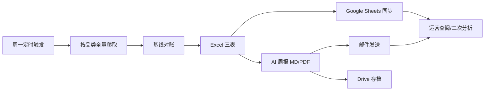

# 产品视角：竞品监控雷达项目设计（侧方案）

> 文档类型：产品侧方案（非工程实施计划）  
> 日期：2026-07-23  
> 关联工程文档：  
> - `doc/summary/BD品类全量爬取请求链路分析.md`  
> - `doc/summary/AT品类全量爬取请求链路分析.md`  
> - `doc/上新下架表逻辑说明.md`  
> - `doc/plan/AI自动化竞品分析BD品类工程化方案.md`  
> - `doc/plan/AT Atelier品类AI竞品分析方案.md`

---

## 1. 要解决什么问题

选品 / 运营需要持续回答三件事：

1. **竞品货盘现在长什么样？**（排序、价格、颜色、尺码、主图、详情）
2. **这一周相对上周变了什么？**（上新、下架、排名涨跌、老款补货）
3. **变化意味着什么？**（趋势摘要，而不是只丢一张大表）

本项目把「进网人工盯店」工程化为：**周频全量采集 → 结构化对账 → 表格同步 → AI 周报投递**。

---

## 2. 产品定位与边界

| 维度 | 说明 |
|------|------|
| 产品名 | 北美伴娘服竞品监控雷达 |
| 用户 | 选品运营、品类运营、需要周度竞品动态的业务方 |
| 品类 | **BD（伴娘裙）**、**AT / Atelier（高定线）** —— 品类隔离，配置/基线/输出/周报分轨 |
| 节奏 | 每周一自动跑一轮（爬取 → 报表 → 邮件/Drive） |
| 不做 | 实时盯价、下单转化归因、站外社媒舆情、非名单站点的随意扩爬 |

**成功标准（产品口径）**

- 周一业务能收到可读周报（邮件），并在 Drive / Sheets 留档可回溯  
- 上新 / 下架 / 排名涨跌可解释、可对回官网列表顺序  
- 单站故障不拖垮另一品类；空爬不污染基线

---

## 3. 业务对象模型（产品语言）

```
品类 Category
  └─ 竞品站点 Site
        └─ 列表页（唯一「在售货盘」来源）
              └─ 款式 SPU（handle / style）
                    └─ 颜色 SKC（生命周期对账主键）
                          └─ 字段：排序、价、图、尺码、详情、差评…
```

| 概念 | 产品含义 | 系统对应 |
|------|----------|----------|
| 货盘快照 | 某站点本周在列表上的全部在售色 | 本轮爬取 + `Active` 基线 |
| 上新 | 本周新出现的色 / 补回货架的色 | 上新表 |
| 下架 | 上周在架、本周列表消失的色 | 下架表 |
| 排名涨跌 | 同色相对上周列表位置变化 | 原始排序表「排名涨跌」 |
| 数据周次 | 本轮业务标签 | ISO 周 `YYYY-Www` |

> 产品口头说「上周/本周」= 上一轮基线 vs 本轮爬取，不是自然周日期 join。详见 `doc/上新下架表逻辑说明.md`。

---

## 4. 站点覆盖（产品清单）

### 4.1 BD 品类

| 站点 | 业务角色 | 列表口径（产品） |
|------|----------|------------------|
| Birdy Grey | 伴娘裙主竞品 | bridesmaid-dresses · 销量向排序 |
| Six Stories | Shopify 竞品 | 伴娘相关 collection |
| Club L London | 伴娘 collection | bridesmaids |
| Babyboo | 伴娘 collection | bridesmaid · 销量向排序 |
| Hello Molly | Nosto 货盘 | Bridesmaid 类目 |
| Azazie | 大盘对标 | bridesmaid-dresses |

### 4.2 AT 品类

| 站点 | 业务角色 | 列表口径（产品） |
|------|----------|------------------|
| Babyboo | Atelier/Dresses 高定 | dresses |
| Oh Polly | Dresses 新到向 | dresses · created-desc |
| House of CB | 新品时间序货盘 | category 时间戳排序 |
| Club L London | all-dresses | all-dresses |
| Azazie | Atelier formal | atelier-formal-dresses |

同一品牌在 BD/AT 下是**两条独立监控线**（不同 URL、不同基线、不同周报），避免货盘串味。

---

## 5. 端到端用户旅程



| 阶段 | 业务感知 | 系统产出 |
|------|----------|----------|
| 采集 | 「这周官网货盘拍了一张照片」 | 各站原始排序表 |
| 对账 | 「和上周比多了啥、少了啥」 | 上新表 / 下架表 |
| 分发 | 「表格里能筛」 | GSheet：全量 + 本次上新/下架 + 变动历史 |
| 解读 | 「不用自己读几千行」 | AI 周报邮件 + PDF |
| 存档 | 「历史周可回看」 | Drive + 基线 JSON（工程侧） |

---

## 6. 交付物设计（产品规格）

### 6.1 站点 Excel（每站三表）

| Sheet | 给谁用 | 一句话 |
|-------|--------|--------|
| 原始排序表 | 运营盯盘、排序研究 | 本周官网顺序 + 涨跌 |
| 上新表 | 选品找新色/新款 | 新 SKC / 新颜色 / 下架后又上新 |
| 下架表 | 清货与竞品收缩信号 | 本周新消失的色及下架前快照 |

### 6.2 Google Sheets

- 站点总表（可筛选）  
- `{前缀}_本次上新` / `_本次下架`（本轮增量）  
- `竞品变动历史`（纵向追加，便于跨周）

### 6.3 周报

| 品类 | 发送窗口（示例 crontab） | 内容重心 |
|------|--------------------------|----------|
| BD | 周一 10:00 | 伴娘裙上新/下架/排序与 Azazie 对照建议 |
| AT | 周一 11:00 | Atelier 货盘变动 + 差评/导航等 AT 增强维度 |

原则：周报基于**当轮 Excel**，不编造无数据支撑的涨跌；初始化周上新/下架为空时需在文案中可感知。

---

## 7. 关键业务规则（产品必须知情）

1. **列表即真相**  
   没出现在监控列表页上的 SKU，不算「在售货盘」，即使详情 API 能搜到。

2. **颜色级生命周期**  
   上新/下架按「款+色」判断；同款新色 ≠ 新款。

3. **首次建基不报警**  
   新站或空基线第一周只建档，不上「全站上新」。

4. **残缺爬取宁可不下架**  
   本轮抓到的在架数过少时，系统跳过下架，避免接口故障造成「假大下架」。

5. **Azazie 未成熟基线**  
   款数不足阈值时仍当初始化，防止冒烟/小样本后的假上新潮。

6. **BD 与 AT 错峰**  
   同机错开爬取窗口，降低浏览器与目标站压力导致的互相踩踏。

---

## 8. 系统能力地图（产品 ↔ 工程）

| 产品能力 | 工程模块 |
|----------|----------|
| 品类隔离调度 | `run.py`、`bd/`、`atelier/` |
| 站点采集 | `bd/sites/*`、`atelier/sites/*`、`common/apis/*` |
| 周对周对账 | `common/baseline_manager.py`、`report_builder.py` |
| 表输出 | `common/data_exporter.py`、`atelier/report_builder.py` |
| Sheets | `common/gsheet_sync.py` |
| 周报 / 邮件 / Drive | `scripts/weekly_*`、`*/ai_assistant/weekly_report_generator.py` |
| 配置 | `.env`、`common/config.py`、`atelier/config.py` |

请求层细节见 summary 下 BD/AT 链路文档；对账细节见上新下架说明。

---

## 9. 角色与协作

| 角色 | 职责 |
|------|------|
| 业务 / 选品 | 定义监控站点与列表 URL、字段优先级、周报收件人、解读反馈 |
| 产品 | 维护本侧方案：范围、口径、验收、变更优先级 |
| 工程 | 采集稳定性、对账正确性、调度与投递、故障兜底 |
| 数据消费方 | Sheets 二次分析、与内部选品流程衔接 |

**变更门禁（建议）**

- 改监控 URL / 排序口径 → 产品确认 + 工程改配置 + 基线影响评估  
- 改上新/下架定义 → 必须同步更新 `上新下架表逻辑说明` 与周报文案  
- 新增站点 → 先定列表「唯一货盘源」，再定字段与初始化周预期

---

## 10. 风险与产品对策

| 风险 | 业务影响 | 对策 |
|------|----------|------|
| 目标站改版 / 反爬 | 缺数、顺序错 | 单站失败告警；宁缺不下架；链路文档维护 |
| 假上新 / 假下架 | 误导选品 | 初始化与 min_active 保护；Azazie 款数门槛 |
| 周报延迟 | 周一决策窗口错过 | cron 错峰；Excel 新鲜度校验 |
| BD/AT 口径混淆 | 看错货盘 | 品类分轨命名、分邮件、分 Drive 路径 |
| 字段期望漂移 | 「表里怎么没有」 | 以字段清单表 + 本侧方案第 6 节为合同 |

---

## 11. 演进方向（侧方案，非承诺排期）

按业务价值排序的可选方向：

1. **覆盖**：新竞品 / 新集合的标准化接入清单（URL、排序、字段、初始化周）  
2. **可读性**：周报结构化章节固定（上新 Top、下架 Top、价格带、色系）  
3. **对照**：竞品上新 vs 我方（如 Azazie）覆盖缺口（已有部分交叉能力可产品化）  
4. **时效**：关键站「加急复爬」而不改基线语义  
5. **质量看板**：每站成功率、空爬、保护阀触发次数的周度健康分

---

## 12. 一页纸总结

```text
我们每周给选品拍一张「竞品货盘照片」，
用上一张照片做 diff，产出上新/下架/排序变化，
同步到表格，再用 AI 写成周一可读的周报。

BD 管伴娘裙，AT 管高定线；两套货盘、两套基线、两套投递。
列表页是唯一真相；颜色是对账原子；残缺数据宁可不下架。
```

---

## 修订记录

| 日期 | 说明 |
|------|------|
| 2026-07-23 | 初版侧方案：产品定位、对象模型、旅程、交付物、规则与风险 |
