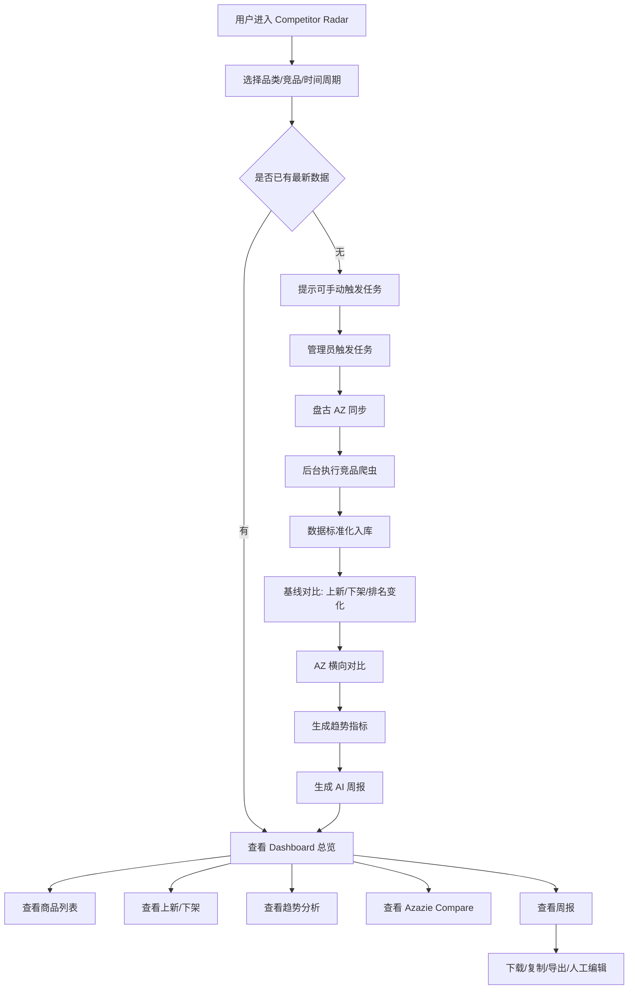
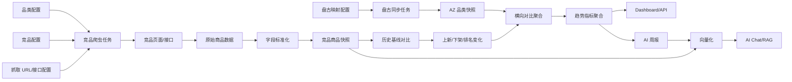
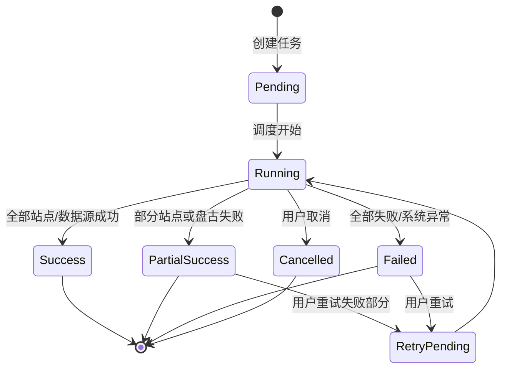

# 竞品雷达 PRD：AT/BD 落地、盘古 AZ 对比与多品类扩展

> 文档版本：v2.2  
> 创建日期：2026-07-16  
> 更新日期：2026-07-16  
> 状态：草案  
> 参考文档：`自动化竞品分析模块PRD.md`  
> 参考报告：  
> - `c:\Users\azazie\Downloads\weekly_report_2026-W28.pdf`（AT / Atelier）  
> - `c:\Users\azazie\Desktop\weekly_report_2026-W28.pdf`（BD / Bridesmaid）

## 1. 项目背景

公司现有自动化竞品分析能力已从最初 BD/伴娘服品类，扩展到 **AT（Atelier / Occasionwear）** 与 **BD（Bridesmaid Dresses）** 两个已落地品类。两份 W28 周报已验证完整闭环：

- 竞品商品抓取与原始排序输出。
- 上新、下架、排名上升、排名下降识别。
- 颜色、面料、领型、设计元素、价格带趋势分析。
- Azazie 横向对比，包括颜色覆盖、价格带差异、设计元素 gap、相似款匹配。
- 基于结构化数据生成 AI 周报，并输出对 Azazie 的选品、列表页、营销素材和颜色建议。

当前下一阶段的核心变化是：**Azazie 商品数据需要从盘古数据源获取**，作为公司内部权威数据源，与竞品数据进行稳定、可复现的横向对比。同时，AT 与 BD 已经完成应用，后续需要继续扩展到 WD、MOB、Party 等其他品类。

本需求目标是将现有脚本能力升级为网站内的「Competitor Radar / 竞品雷达」模块，使其支持多品类、多竞品、多周期、多维度分析，并能长期承接盘古 AZ 数据、竞品抓取数据和 AI 周报。

## 2. 项目目标

### 2.1 业务目标

- 稳定监控 AT、BD 及后续品类下竞品商品的上新、下架、价格、颜色、面料、设计元素和排序变化。
- 从盘古获取 Azazie 商品数据，形成 **AZ vs 竞品** 的横向对比能力。
- 支持商品、设计、运营团队按品类查看竞品策略变化，并输出可执行建议。
- 将 Excel、PDF、Markdown 周报、Google Drive/邮件等分散产物产品化。
- 为 AI 问答、趋势洞察、商品开发建议、周报/月报中心提供结构化数据基础。

### 2.2 产品目标

在现有网站中新增或升级模块：

```text
Global Search / Competitor Radar
```

模块需支持：

- 多品类竞品 Dashboard，默认覆盖 AT、BD。
- 品类级竞品商品列表。
- 上新、下架、排名上升、排名下降监控。
- Azazie 横向对比页，基于盘古 AZ 数据。
- 颜色、面料、款式、设计元素、价格带趋势。
- 周报/月报中心，支持 Markdown 查看、PDF 下载、历史归档。
- AI 竞品问答。
- 后台品类、竞品、盘古映射、词表和任务配置。

## 3. 使用角色

| 角色 | 使用目的 |
|---|---|
| 商品团队 | 查看各品类竞品上新、下架、价格带、颜色趋势、AZ 覆盖 gap，辅助选品与补货 |
| 设计团队 | 查看款式、面料、领型、设计元素趋势，辅助设计 Brief |
| 运营团队 | 查看竞品主推方向、排序变化、热门款式，辅助活动、推荐位和素材规划 |
| 管理层 | 快速查看各品类核心趋势、风险和可执行建议 |
| 数据/开发团队 | 维护盘古同步、爬虫任务、竞品配置、品类配置和数据质量 |

## 4. 品类范围

### 4.1 一期品类

一期不再以单一 BD 为 MVP，而是以 **AT + BD 双品类** 作为已落地基础。

#### AT：Atelier / Occasionwear

当前支持竞品：

- Babyboo Fashion
- Club L London
- House of CB
- Oh Polly

AT 周报已验证重点：

- Club L London、House of CB 等平台的上新与排名变化。
- draped、mini、crepe、jersey、v-neck、plunge、high-neck、long sleeve 等设计元素 gap。
- Black、White、Lemon、Powder Blue、Burgundy 等颜色趋势。
- Azazie 差评分析可选接入，维度包括质量、色差、服务、版型、面料。

#### BD：Bridesmaid Dresses / 伴娘服

当前支持竞品：

- Birdy Grey
- Six Stories
- Club L London
- Babyboo Fashion
- Hello Molly

BD 周报已验证重点：

- Birdy Grey 大规模上新主导，尤其是颜色矩阵和印花/复合命名色扩容。
- Club L London、Babyboo Fashion 的排名上升款用于趋势参考。
- maxi 仍是核心，satin、crepe、matte satin、lace 等面料表达重要。
- 竞品变化款与 Azazie 的价格带关系、颜色覆盖、元素 gap 需要独立于 AT 解读。

> AT 与 BD 可共享部分竞品品牌，但抓取 URL、品类过滤、盘古映射、词表、价格带和周报 Prompt 必须按品类隔离。

### 4.2 未来扩展品类

系统设计必须支持未来新增品类，不允许把字段、页面、逻辑写死为 AT 或 BD。

优先扩展品类包括但不限于：

- Wedding Dresses / WD
- Mother of Bride / MOB
- Party Dresses / Occasion Dresses
- Prom Dresses
- Accessories
- Shoes
- Men
- Kids
- Swatches

建议排期：

| 优先级 | 品类 | 状态/说明 |
|---|---|---|
| 已完成 | AT | 已有 W28 周报样例，需继续接入盘古 AZ-AT |
| 已完成 | BD | 已有 W28 周报样例，需继续接入盘古 AZ-BD |
| P1 | WD | 下一扩展优先级，需新增竞品 URL、盘古映射、属性词表 |
| P2 | MOB / Party | 可复用服装属性模型，但价格带和场景标签需独立配置 |
| P3 | Accessories / Shoes / Men / Kids | 使用独立属性 schema |

### 4.3 品类配置要求

后台需支持配置：

- 品类名称。
- 品类编码，如 `AT`、`BD`、`WD`。
- 品类状态：启用 / 停用。
- 适用品类属性 schema。
- 竞品站点。
- 竞品品类 URL 或接口配置。
- **盘古 AZ 映射规则**：类目 ID、标签、集合 ID 或其他过滤条件。
- 抓取频率。
- 周报生成频率。
- 价格带规则。
- 颜色族规则。
- 面料关键词。
- 款式/设计元素关键词。
- 是否启用 AI 周报。
- 是否启用 PDF、邮件、Google Drive 推送。
- 竞品权重，避免 Birdy Grey 等大体量站点主导 BD 统计。

## 5. 核心数据模型

### 5.1 通用商品字段

所有品类通用字段：

- 数据周次，如 `2026-W28`。
- 品类。
- 网站名。
- 竞品品牌。
- 数据来源：`competitor_crawl` / `pangu`。
- 商品唯一键 / SKC Key。
- 款式 ID / SPU Key。
- 商品名称。
- 商品链接。
- 商品图片。
- 当前排序。
- 排名涨跌。
- 标价。
- 售价。
- 币种。
- 折扣类型。
- 库存状态。
- 尺码。
- 商品状态：在售 / 上新 / 下架 / 下架后又上新。
- 首次出现时间。
- 最近出现时间。
- 下架时间。
- 爬取时间 / 盘古同步时间。

### 5.2 可扩展属性字段

不同品类有不同属性，需使用可扩展属性模型。

服装类可包含：

- 颜色。
- 颜色族。
- 印花/复合色名，BD 中 Birdy Grey 的 Romantic Bouquet 等需保留原始命名。
- 面料。
- 长度。
- 领型。
- 袖型。
- 廓形。
- 设计元素。
- 场景标签。

鞋类可包含：

- 鞋跟高度。
- 鞋型。
- 材质。
- 颜色。
- 尺码。

配饰类可包含：

- 配饰类型。
- 材质。
- 颜色。
- 使用场景。

技术建议：核心字段放主表，品类差异字段放扩展属性表或 JSON 字段。盘古 AZ 数据与竞品数据需映射到同一通用模型，便于横向对比。

### 5.3 Azazie 横向对比指标

基于盘古 AZ 数据与竞品变化数据，需沉淀以下指标：

| 指标组 | 内容 |
|---|---|
| 对比基准 | AZ 品类快照款数、颜色数；竞品上新数、排名上升数 |
| 颜色覆盖 | 竞品上新色在 AZ 是否覆盖；未覆盖颜色 Top 列表 |
| 价格带 | AZ vs 竞品变化款的最低价、中位价、最高价、均价 |
| 元素 gap | 面料、领型、裙型、工艺细节的竞品出现次数、AZ 出现次数、覆盖率 |
| 相似款匹配 | 竞品排名上涨款匹配 Azazie 相似款，并展示匹配信号 |

口径说明：

- 竞品变化款默认包括：竞品上新 + 排名上升款。
- AZ 侧默认使用盘古中该品类全量在售快照。
- AT 与 BD 的价格、颜色和元素解读口径独立配置，不互相套用。

## 6. 功能需求

## 6.1 竞品分析首页 Dashboard

### 功能说明

展示当前所选品类和周期下的竞品核心变化，并将盘古 AZ 快照与竞品变化进行横向对比。

### 顶部筛选

- 品类：默认支持 AT、BD，后续支持 WD、MOB、Party 等。
- 竞品品牌。
- 时间周期：周 / 月 / 自定义。
- 商品状态。
- 价格带。
- 颜色族。
- 面料/材质。
- 款式/设计元素。
- 数据来源：竞品 / Azazie / 全部。

### 核心指标

- 监控竞品数。
- 商品总数。
- Azazie 盘古快照商品数。
- 本期上新数。
- 本期下架数。
- 净变化：上新数 - 下架数。
- 排名波动商品数。
- 竞品变化款中位价。
- Azazie 品类中位价。
- Top gap 元素。
- 数据更新时间。
- 数据质量状态。

### 管理层摘要

- 本期最重要发现。
- 本期主推颜色/材质/款式。
- 竞品变化对 Azazie 的影响。
- 本周/本月建议动作。
- 需要管理层决策的问题。
- 数据质量风险，如 House of CB `Default` 颜色、Birdy Grey 体量过大、盘古字段缺失。

## 6.2 竞品商品列表

### 功能说明

展示指定品类下的竞品商品明细，并支持查看 Azazie 盘古商品快照。

### 表格字段

- 商品图。
- 商品名称。
- 品类。
- 竞品品牌 / Azazie。
- 网站名。
- 数据来源。
- 当前排序。
- 排名涨跌。
- 颜色/主属性。
- 面料/材质。
- 款式/设计元素。
- 标价。
- 售价。
- 币种。
- 折扣类型。
- 尺码/库存。
- 商品状态。
- 首次出现时间。
- 商品链接。

### 操作

- 搜索商品。
- 按品类筛选。
- 按竞品筛选。
- 按颜色、面料、价格带筛选。
- 按状态筛选。
- 导出 CSV。
- 导出 XLSX。
- 点击跳转竞品官网或 Azazie 商品页。
- 查看商品详情弹窗。

## 6.3 上新/下架监控

### Tab

- 本期上新。
- 本期下架。
- 下架后又上新。
- 排名上升。
- 排名下降。

### 上新字段

- 品类。
- 竞品。
- 商品名称。
- 主属性。
- 颜色。
- 价格。
- 尺码。
- 上新类型：新 SKC / 新颜色 / 新属性 / 下架后又上新。
- 上新时间。
- 商品链接。

### 下架字段

- 品类。
- 竞品。
- 商品名称。
- 主属性。
- 下架前排序。
- 下架前价格。
- 最近一次出现时间。
- 下架时间。
- 商品链接。

### 排名变化字段

- 品类。
- 竞品。
- 商品名称。
- 当前排序。
- 上期排序。
- 排名变化值。
- 颜色。
- 面料。
- 设计元素。
- 商品链接。
- 可匹配的 Azazie 相似款。

## 6.4 趋势分析模块

### 功能说明

按品类输出趋势分析，不同品类展示不同趋势维度。AT 与 BD 均为服装类，但业务解读重点不同。

### 服装类趋势

- 颜色趋势。
- 颜色族趋势。
- 印花/复合色名趋势。
- 面料趋势。
- 长度趋势。
- 领型趋势。
- 袖型趋势。
- 廓形趋势。
- 设计元素趋势。
- 价格带趋势。
- Azazie 覆盖 gap。

### AT 趋势重点

- draped、ruched、plunge、v-neck、high-neck、long sleeve、mini、crepe、jersey 等趋势信号。
- House of CB 的高质感场合款需结合材质与商品名判断。
- 颜色字段出现 `Default` 时需进入数据质量提示。

### BD 趋势重点

- Birdy Grey 的大规模颜色/印花扩容。
- maxi、satin、matte satin、lace、crepe 等伴娘服主线。
- Lemon、Espresso、Sage、Powder Blue、Blush、Romantic Bouquet 等颜色/花型表达。
- Birdy Grey 商品量过大时需提供「分站观察」和「整体加权」两种视角。

### 非服装类趋势

系统需根据品类配置展示对应维度，例如：

- 鞋类：鞋型、鞋跟高度、材质、颜色、价格带。
- 配饰：配饰类型、材质、颜色、使用场景、价格带。

## 6.5 周报/月报中心

### 功能说明

展示 AI 自动生成的品类竞品报告。AT 与 BD 均已有 W28 周报样例，后续新品类需复用相近模板并替换品类词表。

### 列表字段

- 报告周期。
- 品类。
- 覆盖竞品。
- Azazie 快照记录数。
- 竞品商品数。
- 上新数。
- 下架数。
- 生成时间。
- 状态：已生成 / 生成失败 / 待生成。
- 盘古同步状态。

### 报告详情

- 执行摘要。
- 品类整体概览。
- 各竞品重点观察。
- 上新/下架/排名变化分析。
- 颜色/材质/款式趋势。
- 价格带变化。
- Azazie 横向对比。
- 对 Azazie 商品、设计、运营建议。
- 数据风险说明。

### AT 报告重点章节

- 竞品上新分析。
- 周对周变化。
- 颜色趋势。
- 设计趋势。
- 对 Azazie 的建议。
- 颜色参考贴图。
- 数据质量说明。
- Azazie 横向对比。
- Azazie 差评分析（可选）。

### BD 报告重点章节

- 周对周变化。
- 各网站重点观察。
- 颜色趋势，包含印花/复合命名色。
- 设计趋势。
- 平台共性。
- Azazie 横向对比。
- 对 Azazie 的建议。
- 数据质量说明。

### 操作

- 查看报告。
- 下载 Markdown。
- 导出 PDF。
- 复制摘要。
- 重新生成。
- 人工编辑最终版。

## 6.6 AI 竞品问答

### 功能说明

基于商品数据、盘古 AZ 快照、历史报告和趋势指标进行问答。

### 示例问题

- 本周 AT 品类哪个竞品上新最多？
- 本周 BD 品类 Birdy Grey 的新增颜色主要有哪些？
- 竞品变化款中哪些颜色 Azazie 没有覆盖？
- AT 里 draped、plunge、crepe 的 Azazie gap 是多少？
- BD 里哪些竞品在推 Lemon / Powder Blue / Blush？
- Wedding Dress 品类上线后，哪些面料趋势最明显？
- 哪些竞品在低价带扩张？
- 给我生成一份某品类设计 Brief。
- 哪些下架款式不建议跟进？

## 6.7 后台配置

### 品类管理

- 新增品类。
- 编辑品类。
- 启用/停用品类。
- 配置品类属性。
- 配置价格带。
- 配置关键词字典。
- 配置是否启用 AI 周报和 Azazie 横向对比。

### 竞品管理

- 新增竞品。
- 编辑竞品。
- 配置竞品站点 URL。
- 配置品类 URL。
- 配置抓取方式。
- 配置站点权重。
- 启用/停用竞品。

### 盘古映射管理

- 为每个品类配置盘古类目、标签、集合或其他过滤条件。
- 显示最近一次同步时间、同步记录数、失败原因。
- 支持测试映射，返回样例商品和记录数。
- AT 与 BD 必须分别配置，禁止共用快照。

### 抓取任务管理

- 手动触发单品类竞品抓取。
- 手动触发单竞品抓取。
- 手动触发盘古同步。
- 手动触发全链路任务：盘古同步 -> 竞品抓取 -> 基线对比 -> 横向对比 -> 周报生成。
- 查看任务状态。
- 查看错误日志。
- 重新执行失败任务。

## 7. 数据更新逻辑

### 7.1 手动触发

支持用户选择：

- 指定品类。
- 指定竞品。
- 全品类。
- 全竞品。
- 仅同步盘古 AZ 数据。
- 仅抓取竞品数据。
- 仅生成周报。
- 仅同步向量库。

### 7.2 定时触发

建议支持按品类配置不同频率：

- 高频品类：每周一次。
- 重点活动品类：每周多次。
- 长周期品类：每月一次。

标准流程：

```text
盘古 AZ 同步 -> 竞品爬虫抓取 -> 标准化入库 -> 基线对比 -> AZ 横向对比 -> 趋势计算 -> 周报生成 -> 向量写入 -> 前端展示
```

### 7.3 盘古同步逻辑

- 每个启用品类需要独立盘古映射。
- 每周固定时点生成 AZ 品类快照。
- 同步结果需记录任务 ID、同步时间、记录数、失败原因。
- 若盘古同步失败，本周周报需标注 AZ 对比不可用，或沿用上一成功快照并显著说明。
- 若映射结果为空，应阻断该品类周报发布并提示检查映射配置。

### 7.4 基线逻辑

- 每品类、每站点维护上一成功周期 baseline。
- 首次运行只建立基线，不将全量商品判定为上新。
- 上新、下架、排名涨跌均相对上一成功 baseline 计算。

## 8. 后端需求

### 8.1 建议数据表

- competitor_sites
- competitor_categories
- competitor_category_site_configs
- competitor_products
- competitor_product_snapshots
- competitor_product_attributes
- competitor_changes
- competitor_trend_metrics
- competitor_reports
- competitor_crawl_jobs
- pangu_category_mappings
- az_product_snapshots
- cross_site_comparison_metrics
- report_assets

### 8.2 API 建议

- `GET /api/competitors/categories`
- `GET /api/competitors/sites`
- `GET /api/competitors/products`
- `GET /api/competitors/changes`
- `GET /api/competitors/trends`
- `GET /api/competitors/reports`
- `GET /api/competitors/reports/{id}`
- `POST /api/competitors/crawl-jobs`
- `GET /api/competitors/crawl-jobs/{id}`
- `POST /api/competitors/reports/generate`
- `POST /api/competitors/export`
- `GET /api/competitors/az-compare`
- `GET /api/competitors/pangu-mappings`
- `POST /api/competitors/pangu-mappings`
- `POST /api/competitors/pangu-sync-jobs`

## 9. 权限需求

### 普通用户

- 查看 Dashboard。
- 查看商品列表。
- 查看趋势分析。
- 查看 Azazie 横向对比。
- 查看周报。
- 导出数据。
- 使用 AI 问答。

### 管理员/数据团队

- 配置品类。
- 配置竞品。
- 配置盘古映射。
- 手动触发任务。
- 查看任务日志。
- 重新执行失败任务。
- 管理 API Key 和凭证。
- 管理周报 Prompt、颜色词表、属性词表和竞品权重。

## 10. MVP 范围

### P0

- 支持 AT、BD 两个已落地品类完整闭环。
- 支持盘古 AZ-AT、AZ-BD 同步与快照。
- 支持品类字段不写死，为未来全品类预留。
- 竞品商品列表。
- 上新/下架/排名变化列表。
- 基础 Dashboard。
- Azazie 横向对比页。
- 周报查看。
- 手动触发任务。
- 任务状态展示。
- 数据质量提示。

### P1

- 多品类配置后台。
- WD 品类扩展闭环。
- 趋势图表。
- AI 问答。
- 周报重新生成。
- 数据导出。
- 数据质量看板。
- PDF 下载、邮件和 Google Drive 推送。
- BD 大体量竞品权重配置。

### P2

- 全品类定时调度。
- 差评分析产品化。
- 周报人工编辑。
- 管理层摘要页。
- Zoom/Slack/飞书推送。
- 更多竞品扩展。
- 跨品类对比分析。

## 11. 验收标准

### 数据验收

- AT 品类可完整展示 Babyboo Fashion、Club L London、House of CB、Oh Polly 数据。
- BD 品类可完整展示 Birdy Grey、Six Stories、Club L London、Babyboo Fashion、Hello Molly 数据。
- 指定周次可分别拉取 AZ-AT、AZ-BD 盘古快照，记录数 > 0，任务状态可查。
- AT 与 BD 的盘古快照互不串用。
- 新增品类时无需改动前端核心页面结构。
- 商品字段支持通用字段 + 品类扩展属性。
- 上新/下架/排名变化结果与自动化脚本输出一致。
- 周报内容基于所选品类数据生成。
- 横向对比结果包括颜色覆盖、价格带、元素 gap、相似款匹配。

### 功能验收

- 用户可按品类、竞品、时间、颜色、面料、状态筛选。
- 用户可查看上新、下架、排名变化。
- 用户可查看 Azazie 横向对比。
- 用户可查看 AT、BD 历史报告。
- 管理员可触发指定品类竞品抓取任务。
- 管理员可触发指定品类盘古同步任务。
- 抓取或盘古同步失败时页面可展示失败原因。

### 性能验收

- 商品列表支持分页。
- 常规筛选响应时间小于 3 秒。
- Dashboard 默认查询小于 5 秒。
- 周报生成异步执行，不阻塞页面。
- 盘古同步任务异步执行，不阻塞页面。

## 12. 风险与注意事项

- 盘古类目与前台 AT、BD 集合可能不完全一致，映射需业务确认，避免漏品或错品。
- 不同品类的属性差异较大，必须设计扩展属性模型。
- 不同竞品网站结构变化会导致抓取失败，需要任务监控。
- House of CB 颜色字段可能出现 `Default`，颜色分析需谨慎。
- Birdy Grey 商品量远大于其他竞品，BD 横向统计时需避免被单站数据主导。
- 不同品类可能使用不同价格带规则，不能全局套用同一价格区间。
- AT 与 BD 的竞品变化款中位价相对 Azazie 的高低关系可能相反，周报解读不能套模板。
- 首次运行主要建立基线，不应误判为全部上新。
- AI 周报必须基于结构化数据生成，不能允许模型编造不存在的数据。
- 多币种价格对比需要统一口径，避免美元与英镑直接比较。

## 13. 整体业务流程图

### 13.1 用户使用主流程



### 13.2 数据处理主流程



### 13.3 任务状态流



## 14. 页面结构与线框说明

### 14.1 导航结构

建议在左侧导航中复用现有 Global Search 导航：

```text
Global Search
├── Competitor Radar
│   ├── Overview
│   ├── Products
│   ├── New & Delisted
│   ├── Azazie Compare
│   ├── Trend Analysis
│   ├── Reports
│   └── Crawl Jobs
└── Settings
    ├── Categories
    ├── Competitor Sites
    ├── Pangu Mapping
    └── Attribute Dictionaries
```

### 14.2 Overview 页面线框

```text
┌──────────────────────────────────────────────────────────────────────────────┐
│ Competitor Radar                                                            │
│ [品类 Select: AT/BD/WD] [竞品 MultiSelect] [周期] [日期范围] [Refresh Data]   │
├──────────────────────────────────────────────────────────────────────────────┤
│ KPI Cards                                                                    │
│ ┌──────────┐ ┌──────────┐ ┌──────────┐ ┌──────────┐ ┌──────────┐            │
│ │商品总数  │ │上新数    │ │下架数    │ │AZ快照数  │ │数据质量  │            │
│ └──────────┘ └──────────┘ └──────────┘ └──────────┘ └──────────┘            │
├──────────────────────────────────────────────────────────────────────────────┤
│ 管理层摘要                                                                    │
│ - 本期核心发现                                                                │
│ - 对 Azazie 商品/颜色/设计建议                                                │
│ - 数据风险提示                                                                │
├──────────────────────────────────────────────────────────────────────────────┤
│ Charts                                                                        │
│ ┌─────────────────────┐ ┌─────────────────────┐ ┌─────────────────────┐     │
│ │竞品上新/下架对比     │ │颜色 Top 10           │ │AZ vs 竞品价格带       │     │
│ └─────────────────────┘ └─────────────────────┘ └─────────────────────┘     │
├──────────────────────────────────────────────────────────────────────────────┤
│ Tables                                                                        │
│ ┌──────────────────────────────┐ ┌────────────────────────────────────┐      │
│ │排名上升 Top 商品              │ │Azazie gap Top 元素                 │      │
│ └──────────────────────────────┘ └────────────────────────────────────┘      │
└──────────────────────────────────────────────────────────────────────────────┘
```

### 14.3 Products 页面线框

```text
┌──────────────────────────────────────────────────────────────────────────────┐
│ Products                                                                     │
│ [搜索框] [品类] [竞品/AZ] [状态] [颜色] [面料] [价格带] [导出 CSV/XLSX]         │
├──────────────────────────────────────────────────────────────────────────────┤
│ 商品表格                                                                      │
│ 图片 | 商品名 | 品类 | 来源 | 排序 | 涨跌 | 颜色 | 材质 | 属性 | 价格 | 状态   │
│ ---------------------------------------------------------------------------- │
│ img  | ...    | BD   | BG   | 1    | +3   | Sage | Satin | Halter | $129 | 在售│
│ img  | ...    | AT   | AZ   | -    | -    | Black| Crepe | Draped | $139 | 在售│
├──────────────────────────────────────────────────────────────────────────────┤
│ 分页：每页 50/100/200                                                         │
└──────────────────────────────────────────────────────────────────────────────┘
```

### 14.4 New & Delisted 页面线框

```text
┌──────────────────────────────────────────────────────────────────────────────┐
│ New & Delisted                                                               │
│ [品类] [竞品] [周期] [上新类型] [导出]                                        │
├──────────────────────────────────────────────────────────────────────────────┤
│ Tabs: 本期上新 | 本期下架 | 下架后又上新 | 排名上升 | 排名下降                 │
├──────────────────────────────────────────────────────────────────────────────┤
│ 表格字段随 Tab 切换                                                           │
│ 上新：品类 | 竞品 | 商品 | 颜色 | 价格 | 上新类型 | 上新时间 | 链接             │
│ 下架：品类 | 竞品 | 商品 | 下架前排序 | 下架前价格 | 最近出现 | 下架时间 | 链接  │
└──────────────────────────────────────────────────────────────────────────────┘
```

### 14.5 Azazie Compare 页面线框

```text
┌──────────────────────────────────────────────────────────────────────────────┐
│ Azazie Compare                                                               │
│ [品类] [周期] [竞品] [对比口径: 上新+上升/仅上新]                              │
├──────────────────────────────────────────────────────────────────────────────┤
│ Summary                                                                      │
│ AZ 快照款数 | AZ 颜色数 | 竞品变化款数 | 竞品变化中位价 | AZ 中位价              │
├──────────────────────────────────────────────────────────────────────────────┤
│ Tables                                                                       │
│ 1. 竞品上新颜色 · Azazie 覆盖情况                                             │
│ 2. 价格带差异                                                                │
│ 3. 面料 / 领型 / 设计元素 gap                                                 │
│ 4. 竞品排名上涨款 · Azazie 相似款匹配                                         │
└──────────────────────────────────────────────────────────────────────────────┘
```

### 14.6 Reports 页面线框

```text
┌──────────────────────────────────────────────────────────────────────────────┐
│ Weekly / Monthly Reports                                                     │
│ [品类] [周期] [状态] [Generate Report]                                       │
├──────────────────────────────────────────────────────────────────────────────┤
│ 报告列表                                                                      │
│ 周期 | 品类 | 竞品数 | AZ快照数 | 商品数 | 上新 | 下架 | 生成时间 | 状态 | 操作 │
├──────────────────────────────────────────────────────────────────────────────┤
│ 报告详情                                                                      │
│ # 本期竞品趋势报告                                                            │
│ ## 执行摘要                                                                   │
│ ## 各竞品观察                                                                 │
│ ## 颜色/材质/款式趋势                                                         │
│ ## Azazie 横向对比                                                            │
│ ## 对 Azazie 建议                                                             │
│ [Download MD] [Export PDF] [Copy Summary] [Edit Final Version]                │
└──────────────────────────────────────────────────────────────────────────────┘
```

### 14.7 Crawl Jobs 页面线框

```text
┌──────────────────────────────────────────────────────────────────────────────┐
│ Crawl Jobs                                                                   │
│ [Run Crawl] [Run Pangu Sync] [Run Full Pipeline] [品类] [竞品] [状态]          │
├──────────────────────────────────────────────────────────────────────────────┤
│ 任务列表                                                                      │
│ Job ID | 品类 | 类型 | 竞品/数据源 | 触发方式 | 状态 | 开始时间 | 结束时间 | 操作 │
├──────────────────────────────────────────────────────────────────────────────┤
│ 任务详情                                                                      │
│ - 已成功站点 / 数据源                                                          │
│ - 失败站点 / 数据源                                                            │
│ - 错误日志                                                                    │
│ - 输出文件                                                                    │
│ - Retry Failed Tasks                                                          │
└──────────────────────────────────────────────────────────────────────────────┘
```

## 15. 核心交互流程

### 15.1 查看某品类竞品趋势

1. 用户进入 `Competitor Radar / Overview`。
2. 默认选中最近一周、全部竞品、默认品类。
3. 用户切换品类，例如 `AT` 或 `BD`。
4. 页面刷新 KPI、图表、管理层摘要和 Azazie 横向对比摘要。
5. 用户点击颜色趋势卡片，跳转到 `Trend Analysis` 并带入筛选条件。
6. 用户点击具体颜色，例如 `Lemon` 或 `Powder Blue`，跳转到 `Products` 查看相关商品。

### 15.2 管理员手动触发抓取

1. 管理员进入 `Crawl Jobs`。
2. 点击 `Run Full Pipeline`。
3. 选择执行范围：
   - 单品类 + 全竞品。
   - 单品类 + 单竞品。
   - 单品类 + 盘古同步。
   - 全品类 + 全竞品。
4. 点击确认后创建任务。
5. 前端展示任务状态 `Pending -> Running`。
6. 任务完成后展示 `Success / Partial Success / Failed`。
7. 成功后 Dashboard 提示数据已更新。

### 15.3 生成 AI 周报

1. 用户进入 `Reports`。
2. 选择品类和周期。
3. 若无报告，显示 `Generate Report`。
4. 用户点击生成，后端创建异步任务。
5. 生成过程中状态为 `Generating`。
6. 生成成功后展示报告正文。
7. 用户可下载 Markdown、导出 PDF、复制摘要或编辑最终版。

### 15.4 新增品类配置

1. 管理员进入 `Settings / Categories`。
2. 点击 `Create Category`。
3. 填写品类名称、编码、属性模板和价格带。
4. 进入 `Competitor Sites`，为该品类配置竞品 URL。
5. 进入 `Pangu Mapping`，配置 Azazie 对应类目/标签/集合。
6. 配置抓取频率和是否启用周报。
7. 保存后，可在 `Crawl Jobs` 中手动触发该品类全链路任务。

## 16. 数据模型详细设计

### 16.1 competitor_categories

| 字段 | 类型 | 说明 |
|---|---|---|
| id | bigint | 主键 |
| category_code | varchar | 品类编码，如 `AT`、`BD`、`WD` |
| category_name | varchar | 品类名称 |
| parent_category_id | bigint | 父级品类，可为空 |
| attribute_schema | json | 该品类支持的扩展属性 |
| price_band_config | json | 价格带配置 |
| enabled | boolean | 是否启用 |
| created_at | datetime | 创建时间 |
| updated_at | datetime | 更新时间 |

### 16.2 competitor_sites

| 字段 | 类型 | 说明 |
|---|---|---|
| id | bigint | 主键 |
| site_code | varchar | 竞品编码 |
| site_name | varchar | 竞品名称 |
| brand_name | varchar | 品牌名称 |
| base_url | varchar | 官网域名 |
| country | varchar | 国家/市场 |
| currency | varchar | 默认币种 |
| enabled | boolean | 是否启用 |
| created_at | datetime | 创建时间 |
| updated_at | datetime | 更新时间 |

### 16.3 competitor_category_site_configs

| 字段 | 类型 | 说明 |
|---|---|---|
| id | bigint | 主键 |
| category_id | bigint | 品类 ID |
| site_id | bigint | 竞品站点 ID |
| source_url | varchar | 该竞品该品类抓取入口 |
| crawler_key | varchar | 对应爬虫标识 |
| crawl_frequency | varchar | weekly/daily/monthly |
| min_expected_active | int | 最低商品数保护阈值 |
| weight | decimal | 统计权重，BD 中 Birdy Grey 可单独配置 |
| enabled | boolean | 是否启用 |
| config_json | json | 站点差异配置 |

### 16.4 pangu_category_mappings

| 字段 | 类型 | 说明 |
|---|---|---|
| id | bigint | 主键 |
| category_id | bigint | 竞品雷达品类 ID |
| pangu_category_id | varchar | 盘古类目 ID，可为空 |
| pangu_collection_id | varchar | 盘古集合 ID，可为空 |
| pangu_tags | json | 盘古标签过滤 |
| filter_json | json | 其他过滤条件 |
| enabled | boolean | 是否启用 |
| last_sync_at | datetime | 最近同步时间 |
| last_sync_count | int | 最近同步记录数 |
| created_at | datetime | 创建时间 |
| updated_at | datetime | 更新时间 |

### 16.5 competitor_products

| 字段 | 类型 | 说明 |
|---|---|---|
| id | bigint | 主键 |
| category_id | bigint | 品类 ID |
| site_id | bigint | 竞品 ID |
| product_skc_key | varchar | 商品唯一键 |
| style_spu_key | varchar | 款式 ID |
| product_name | varchar | 商品名称 |
| product_url | varchar | 商品链接 |
| image_url | varchar | 主图 |
| first_seen_at | datetime | 首次出现时间 |
| last_seen_at | datetime | 最近出现时间 |
| current_status | varchar | active/delisted |
| created_at | datetime | 创建时间 |
| updated_at | datetime | 更新时间 |

### 16.6 competitor_product_snapshots

| 字段 | 类型 | 说明 |
|---|---|---|
| id | bigint | 主键 |
| product_id | bigint | 商品 ID |
| data_week | varchar | 数据周次 |
| crawl_job_id | bigint | 抓取任务 ID |
| current_rank | int | 当前排序 |
| previous_rank | int | 上期排序 |
| rank_change | varchar | 排名涨跌 |
| color_name | varchar | 颜色 |
| original_price | decimal | 标价 |
| sale_price | decimal | 售价 |
| currency | varchar | 币种 |
| discount_type | varchar | 折扣类型 |
| stock_type | varchar | 库存状态 |
| size_text | text | 尺码 |
| detail_text | text | 商品详情 |
| raw_json | json | 原始抓取数据 |
| created_at | datetime | 创建时间 |

### 16.7 az_product_snapshots

| 字段 | 类型 | 说明 |
|---|---|---|
| id | bigint | 主键 |
| category_id | bigint | 品类 ID |
| pangu_mapping_id | bigint | 盘古映射 ID |
| data_week | varchar | 数据周次 |
| sync_job_id | bigint | 盘古同步任务 ID |
| product_skc_key | varchar | AZ 商品唯一键 |
| style_spu_key | varchar | AZ 款式 ID |
| product_name | varchar | 商品名称 |
| product_url | varchar | 商品链接 |
| image_url | varchar | 主图 |
| color_name | varchar | 颜色 |
| original_price | decimal | 标价 |
| sale_price | decimal | 售价 |
| currency | varchar | 币种 |
| stock_type | varchar | 库存状态 |
| raw_json | json | 盘古原始数据 |
| created_at | datetime | 创建时间 |

### 16.8 competitor_product_attributes

| 字段 | 类型 | 说明 |
|---|---|---|
| id | bigint | 主键 |
| product_id | bigint | 商品 ID，可为空 |
| az_snapshot_id | bigint | AZ 快照 ID，可为空 |
| snapshot_id | bigint | 竞品快照 ID，可为空 |
| attribute_key | varchar | 属性 key，如 fabric/neckline |
| attribute_name | varchar | 属性中文名 |
| attribute_value | varchar | 属性值 |
| normalized_value | varchar | 标准化值 |

### 16.9 competitor_changes

| 字段 | 类型 | 说明 |
|---|---|---|
| id | bigint | 主键 |
| category_id | bigint | 品类 ID |
| site_id | bigint | 竞品 ID |
| product_id | bigint | 商品 ID |
| data_week | varchar | 数据周次 |
| change_type | varchar | new/delisted/relisted/rank_up/rank_down |
| change_detail | json | 变化详情 |
| detected_at | datetime | 识别时间 |

### 16.10 cross_site_comparison_metrics

| 字段 | 类型 | 说明 |
|---|---|---|
| id | bigint | 主键 |
| category_id | bigint | 品类 ID |
| data_week | varchar | 数据周次 |
| metric_type | varchar | color_coverage/price_gap/attribute_gap/similar_match |
| metric_key | varchar | 指标 key |
| metric_value | json | 指标内容 |
| generated_at | datetime | 生成时间 |

### 16.11 competitor_reports

| 字段 | 类型 | 说明 |
|---|---|---|
| id | bigint | 主键 |
| category_id | bigint | 品类 ID |
| report_period | varchar | 周期，如 2026-W28 |
| report_type | varchar | weekly/monthly |
| title | varchar | 报告标题 |
| content_md | text | Markdown 内容 |
| pdf_url | varchar | PDF 文件地址 |
| summary | text | 摘要 |
| status | varchar | pending/generating/success/failed |
| generated_by | varchar | ai/manual |
| created_at | datetime | 创建时间 |
| updated_at | datetime | 更新时间 |

### 16.12 competitor_crawl_jobs

| 字段 | 类型 | 说明 |
|---|---|---|
| id | bigint | 主键 |
| job_type | varchar | crawl/pangu_sync/report/vector_sync/full_pipeline |
| category_id | bigint | 品类 ID，可为空 |
| site_id | bigint | 竞品 ID，可为空 |
| trigger_type | varchar | manual/scheduled |
| status | varchar | pending/running/success/partial_success/failed/cancelled |
| started_at | datetime | 开始时间 |
| finished_at | datetime | 结束时间 |
| duration_seconds | int | 耗时 |
| success_count | int | 成功数量 |
| failed_count | int | 失败数量 |
| error_message | text | 错误摘要 |
| log_url | varchar | 日志地址 |
| output_url | varchar | 输出文件地址 |

## 17. API 详细设计

### 17.1 获取品类列表

```http
GET /api/competitors/categories
```

返回：

```json
{
  "data": [
    {
      "id": 1,
      "categoryCode": "AT",
      "categoryName": "Atelier",
      "enabled": true
    },
    {
      "id": 2,
      "categoryCode": "BD",
      "categoryName": "Bridesmaid Dresses",
      "enabled": true
    }
  ]
}
```

### 17.2 获取 Dashboard

```http
GET /api/competitors/dashboard?categoryId=2&period=2026-W28&siteIds=1,2,3
```

返回：

```json
{
  "category": "Bridesmaid Dresses",
  "period": "2026-W28",
  "metrics": {
    "totalCompetitorProducts": 1285,
    "azSnapshotProducts": 589,
    "newProducts": 194,
    "delistedProducts": 29,
    "rankUpProducts": 285,
    "sitesCount": 5,
    "dataQualityScore": 97.8
  },
  "topColors": [],
  "topFabrics": [],
  "topMovers": [],
  "azGapSummary": []
}
```

### 17.3 获取商品列表

```http
GET /api/competitors/products?categoryId=1&siteId=1&status=active&page=1&pageSize=50
```

关键筛选参数：

- categoryId
- siteId
- period
- sourceType
- status
- color
- material
- attributeKey
- attributeValue
- priceMin
- priceMax
- keyword
- sortBy
- sortOrder

### 17.4 获取 Azazie 横向对比

```http
GET /api/competitors/az-compare?categoryId=1&period=2026-W28
```

返回内容包括：

- 竞品上新颜色 · Azazie 覆盖情况。
- 价格带差异。
- 面料 / 领型 / 设计元素差异。
- 竞品排名上涨款 · Azazie 相似款匹配。

### 17.5 创建抓取任务

```http
POST /api/competitors/crawl-jobs
```

请求：

```json
{
  "jobType": "full_pipeline",
  "categoryIds": [1, 2],
  "siteIds": [1, 2, 3, 4, 5],
  "triggerType": "manual",
  "syncPanguBeforeCrawl": true,
  "generateReportAfterCrawl": true
}
```

返回：

```json
{
  "jobId": 10001,
  "status": "pending"
}
```

### 17.6 获取任务详情

```http
GET /api/competitors/crawl-jobs/10001
```

返回：

```json
{
  "jobId": 10001,
  "status": "running",
  "progress": 60,
  "startedAt": "2026-07-16 15:00:00",
  "steps": [
    {
      "name": "pangu_sync",
      "status": "success",
      "recordsCount": 589
    },
    {
      "name": "competitor_crawl",
      "siteName": "Birdy Grey",
      "status": "running"
    }
  ]
}
```

### 17.7 配置盘古映射

```http
POST /api/competitors/pangu-mappings
```

请求：

```json
{
  "categoryId": 2,
  "panguCategoryId": "bd",
  "panguCollectionId": "bridesmaid_dresses",
  "panguTags": ["bridesmaid"],
  "enabled": true
}
```

## 18. 异常与空状态设计

### 18.1 数据为空

场景：

- 首次进入新品类，尚未抓取。
- 选择的筛选条件无数据。
- 盘古映射未配置。

页面提示：

```text
当前筛选条件下暂无竞品数据。
你可以调整筛选条件，或联系管理员触发该品类数据任务。
```

管理员额外显示：

```text
[Run Full Pipeline Now]
```

### 18.2 首次运行

首次运行只建立基线，不应把所有商品识别为上新。

页面提示：

```text
当前周期为该品类首次采集，本期仅展示全量商品数据。
上新、下架、排名涨跌将在下一次采集后开始计算。
```

### 18.3 部分竞品失败

页面顶部展示黄色提示：

```text
本期数据部分更新成功。Club L London 抓取失败，当前图表未包含该竞品最新数据。
```

用户可点击：

```text
View Job Detail / Retry Failed Sites
```

### 18.4 盘古同步失败

盘古同步失败会影响 Azazie 横向对比，但不应阻断竞品数据展示。

页面提示：

```text
竞品数据已更新，但 Azazie 盘古数据同步失败。本期 Azazie 横向对比不可用或使用上一成功快照。
```

### 18.5 Google Sheets / Drive 同步失败

该错误不应影响网站本地数据展示。

提示：

```text
商品数据已成功入库，但 Google Sheets 或 Google Drive 同步失败。请检查 Spreadsheet ID、Drive 文件夹或服务账号权限。
```

### 18.6 AI 周报失败

页面显示报告状态为 `failed`，并展示：

```text
AI 报告生成失败。结构化商品数据仍可正常查看。
```

操作：

- Retry Generate。
- View Error。
- Contact Admin。

### 18.7 数据质量异常

示例：

- House of CB 颜色字段大量为 `Default`。
- Birdy Grey 单站上新量过大，主导 BD 全局统计。
- 盘古中某品类颜色数异常偏少。

页面提示：

```text
本期存在数据质量提示，部分颜色或趋势结论需谨慎解读。
```

## 19. 埋点与数据分析需求

### 19.1 用户行为埋点

| 事件名 | 触发时机 | 关键字段 |
|---|---|---|
| competitor_radar_view | 进入模块首页 | user_id, category_id, period |
| competitor_filter_apply | 应用筛选 | category_id, site_ids, filters |
| competitor_product_click | 点击商品详情/外链 | product_id, site_id, category_id |
| competitor_az_compare_view | 查看 Azazie 横向对比 | category_id, period |
| competitor_export_click | 点击导出 | export_type, category_id, filters |
| competitor_report_view | 查看周报 | report_id, category_id, period |
| competitor_report_generate | 点击生成周报 | category_id, period |
| competitor_crawl_trigger | 手动触发抓取 | category_ids, site_ids |
| competitor_pangu_sync_trigger | 手动触发盘古同步 | category_ids |
| competitor_ai_question | AI 问答提问 | category_id, question_type |

### 19.2 运营监控指标

- 模块日活用户数。
- 人均查看品类数。
- 商品外链点击数。
- Azazie Compare 查看次数。
- 周报查看次数。
- 数据导出次数。
- AI 问答次数。
- 手动抓取触发次数。
- 盘古同步成功率。
- 抓取成功率。
- 周报生成成功率。

## 20. 开发拆分建议

### 20.1 前端

- 新增 Competitor Radar 路由和左侧导航。
- 实现 Overview、Products、New & Delisted、Azazie Compare、Reports、Crawl Jobs 页面。
- 实现通用筛选组件：品类、竞品、周期、属性、价格带。
- 实现表格分页、导出、商品详情弹窗。
- 实现任务状态轮询。
- 实现数据质量 Banner。

### 20.2 后端

- 将当前 Python 脚本封装为异步任务。
- 建立竞品数据表、AZ 快照表和横向对比指标表。
- 实现盘古同步服务。
- 实现基线对比逻辑服务化。
- 实现 Dashboard 聚合接口。
- 实现 Azazie Compare 聚合接口。
- 实现趋势指标计算。
- 实现周报生成接口。
- 实现任务状态和日志接口。

### 20.3 数据/爬虫

- 将现有 AT、BD 竞品站点接入任务系统。
- 抽象品类配置和竞品 URL 配置。
- 配置 AT、BD 盘古映射。
- 增加抓取数据质量校验。
- 增加失败重试和告警。
- 为 WD、MOB、Party 等未来新增品类沉淀爬虫模板。

### 20.4 AI

- 将商品明细、AZ 快照、横向对比指标和周报写入向量库。
- AI 问答需带品类、周期、竞品过滤条件。
- AT 与 BD 使用各自 Prompt、词表和竞品集。
- 周报生成必须基于结构化数据，不允许无来源生成结论。
- 周报中需标注数据风险和样本限制。

## 21. 视觉与组件建议

### 21.1 复用现有网站风格

竞品分析模块应尽量复用现有网站视觉体系，避免独立风格。可复用组件包括：

- 左侧导航。
- 顶部面包屑。
- 筛选栏。
- 数据表格。
- Export CSV / Export XLSX 按钮。
- 标签筛选 chip。
- 数据统计卡片。
- 报告 Viewer。

### 21.2 页面组件清单

- CategorySelect。
- CompetitorMultiSelect。
- PeriodPicker。
- AttributeFilter。
- PriceBandFilter。
- SourceTypeFilter。
- MetricCard。
- TrendChart。
- ProductTable。
- ChangeTable。
- AzazieCompareTable。
- ReportViewer。
- CrawlJobStatus。
- PanguSyncStatus。
- DataQualityBanner。
- ExportButton。

## 22. 一句话总结

本项目不是将 AT、BD 两套竞品分析脚本简单嵌入网站，而是以 AT/BD 已落地周报为标杆，接入盘古 Azazie 商品数据，升级为一个支持 AZ 横向对比、AI 周报和未来多品类扩展的「竞品雷达平台」。
