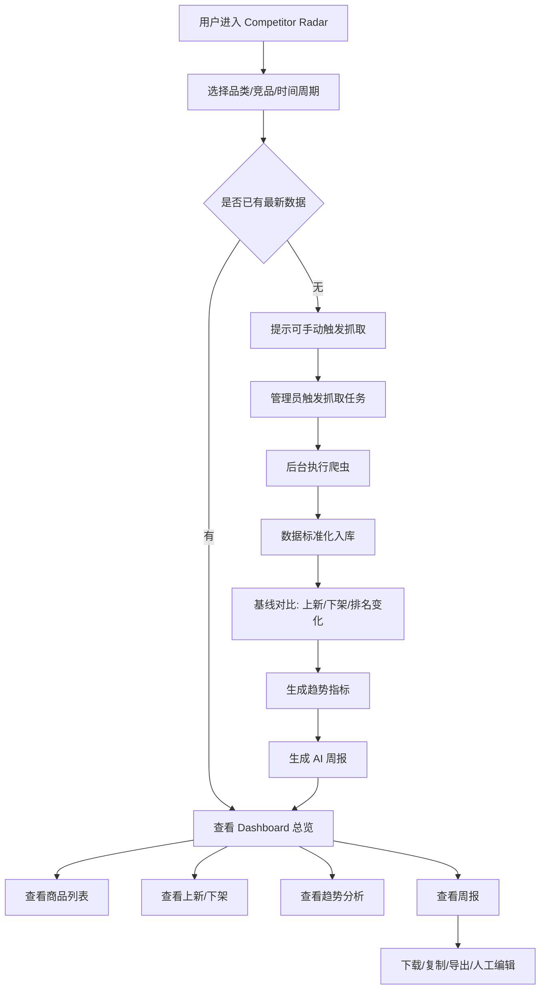
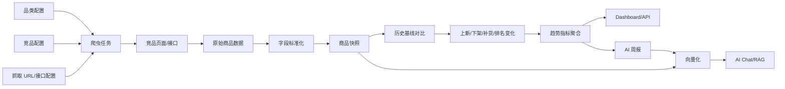
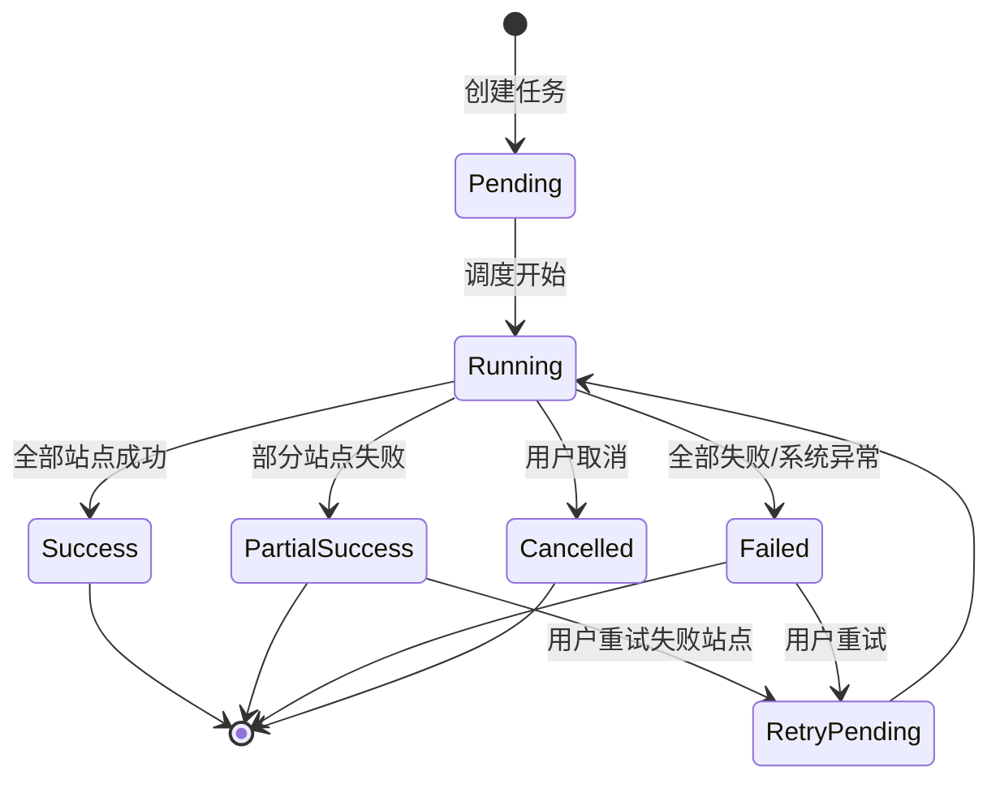

# 自动化竞品分析模块 PRD

## 1. 项目背景

公司现有网站已基于全球品类数据，提供商品、评论、标签、AI Chat、市场洞察等能力。当前已有一套“AI 自动化竞品分析”脚本能力，已可针对 BD/伴娘服品类抓取竞品商品数据，并生成原始排序、上新、下架和 AI 周报。

但该能力未来不应仅服务 BD 单一品类，而应升级为可扩展的“全品类竞品监控平台”。未来可逐步支持 Wedding Dress、Mother of Bride、Prom、Party Dress、Accessories、Shoes、Men、Kids 等更多品类。

本需求目标是将现有自动化竞品分析能力嵌入公司数据分析网站，形成一个支持多品类、多竞品、多周期、多维度分析的竞品雷达模块。

## 2. 项目目标

### 2.1 业务目标

- 自动监控不同品类下竞品商品的上新、下架、价格、颜色、面料、款式和排序变化。
- 帮助商品、设计、运营团队按品类查看竞品策略变化。
- 支持从单一 BD 品类扩展为全品类竞品分析能力。
- 将 Excel、Google Sheets、Markdown 周报等分散产物产品化。
- 为 AI 问答、趋势洞察、商品开发建议提供结构化数据基础。

### 2.2 产品目标

在现有网站中新增模块：

```text
Global Search / Competitor Radar
```

模块需支持：

- 多品类竞品 Dashboard
- 品类级竞品商品列表
- 上新/下架监控
- 颜色、面料、款式、价格带趋势
- 周报/月报中心
- AI 竞品问答
- 后台品类与竞品配置

## 3. 使用角色

| 角色 | 使用目的 |
|---|---|
| 商品团队 | 查看各品类竞品上新、下架、价格带、颜色趋势，辅助选品 |
| 设计团队 | 查看款式、面料、领型、设计元素趋势，辅助设计 Brief |
| 运营团队 | 查看竞品主推方向、排序变化、热门款式，辅助活动和内容规划 |
| 管理层 | 快速查看各品类核心趋势和可执行建议 |
| 数据/开发团队 | 维护爬虫任务、竞品配置、品类配置和数据质量 |

## 4. 品类范围

### 4.1 一期品类

一期以当前已实现的 BD/伴娘服品类为 MVP。

当前支持竞品：

- Birdy Grey
- Six Stories
- Club L London
- Babyboo Fashion
- Hello Molly

### 4.2 未来扩展品类

系统设计必须支持未来新增品类，不允许把字段、页面、逻辑写死为 BD。

未来可扩展品类包括但不限于：

- Bridesmaid Dresses
- Wedding Dresses
- Mother of Bride
- Prom Dresses
- Party Dresses
- Occasion Dresses
- Accessories
- Shoes
- Men
- Kids
- Swatches

### 4.3 品类配置要求

后台需支持配置：

- 品类名称
- 品类编码
- 适用品类属性
- 竞品站点
- 竞品品类 URL
- 抓取频率
- 价格带规则
- 颜色族规则
- 面料关键词
- 款式/设计元素关键词
- 是否启用 AI 周报

## 5. 核心数据模型

### 5.1 通用商品字段

所有品类通用字段：

- 数据周次
- 品类
- 网站名
- 竞品品牌
- 商品唯一键 / SKC Key
- 款式 ID / SPU Key
- 商品名称
- 商品链接
- 商品图片
- 当前排序
- 排名涨跌
- 标价
- 售价
- 折扣类型
- 库存状态
- 尺码
- 商品状态：在售 / 上新 / 下架 / 下架后又上新
- 首次出现时间
- 最近出现时间
- 下架时间
- 爬取时间

### 5.2 可扩展属性字段

不同品类有不同属性，需使用可扩展属性模型。

服装类可包含：

- 颜色
- 颜色族
- 面料
- 长度
- 领型
- 袖型
- 廓形
- 设计元素
- 场景标签

鞋类可包含：

- 鞋跟高度
- 鞋型
- 材质
- 颜色
- 尺码

配饰类可包含：

- 配饰类型
- 材质
- 颜色
- 使用场景

技术建议：核心字段放主表，品类差异字段放扩展属性表或 JSON 字段。

## 6. 功能需求

## 6.1 竞品分析首页 Dashboard

### 功能说明

展示当前所选品类和周期下的竞品核心变化。

### 顶部筛选

- 品类
- 竞品品牌
- 时间周期：周 / 月 / 自定义
- 商品状态
- 价格带
- 颜色族
- 面料/材质
- 款式/设计元素

### 核心指标

- 监控竞品数
- 商品总数
- 本期上新数
- 本期下架数
- 净变化：上新数 - 下架数
- 排名波动商品数
- 数据更新时间
- 数据质量状态

### 管理层摘要

- 本期最重要发现
- 本期主推颜色/材质/款式
- 对自有商品的影响
- 本周/本月建议动作
- 需要管理层决策的问题

## 6.2 竞品商品列表

### 功能说明

展示指定品类下的竞品商品明细。

### 表格字段

- 商品图
- 商品名称
- 品类
- 竞品品牌
- 网站名
- 当前排序
- 排名涨跌
- 颜色/主属性
- 面料/材质
- 款式/设计元素
- 标价
- 售价
- 折扣类型
- 尺码/库存
- 商品状态
- 首次出现时间
- 商品链接

### 操作

- 搜索商品
- 按品类筛选
- 按竞品筛选
- 按颜色、面料、价格带筛选
- 按状态筛选
- 导出 CSV
- 导出 XLSX
- 点击跳转竞品官网
- 查看商品详情弹窗

## 6.3 上新/下架监控

### Tab

- 本期上新
- 本期下架
- 下架后又上新
- 排名上升
- 排名下降

### 上新字段

- 品类
- 竞品
- 商品名称
- 主属性
- 颜色
- 价格
- 尺码
- 上新类型：新 SKC / 新颜色 / 新属性 / 下架后又上新
- 上新时间
- 商品链接

### 下架字段

- 品类
- 竞品
- 商品名称
- 主属性
- 下架前排序
- 下架前价格
- 最近一次出现时间
- 下架时间
- 商品链接

## 6.4 趋势分析模块

### 功能说明

按品类输出趋势分析，不同品类展示不同趋势维度。

### 服装类趋势

- 颜色趋势
- 颜色族趋势
- 面料趋势
- 长度趋势
- 领型趋势
- 袖型趋势
- 廓形趋势
- 设计元素趋势
- 价格带趋势

### 非服装类趋势

系统需根据品类配置展示对应维度，例如：

- 鞋类：鞋型、鞋跟高度、材质、颜色、价格带
- 配饰：配饰类型、材质、颜色、使用场景、价格带

## 6.5 周报/月报中心

### 功能说明

展示 AI 自动生成的品类竞品报告。

### 列表字段

- 报告周期
- 品类
- 覆盖竞品
- 商品数
- 上新数
- 下架数
- 生成时间
- 状态：已生成 / 生成失败 / 待生成

### 报告详情

- 品类整体概览
- 各竞品重点观察
- 上新/下架分析
- 颜色/材质/款式趋势
- 价格带变化
- 对自有商品建议
- 数据风险说明

### 操作

- 查看报告
- 下载 Markdown
- 导出 PDF
- 复制摘要
- 重新生成
- 人工编辑最终版

## 6.6 AI 竞品问答

### 功能说明

基于商品数据、历史报告和趋势指标进行问答。

### 示例问题

- 本周 BD 品类哪个竞品上新最多？
- Prom 品类最近哪些颜色在上升？
- Wedding Dress 品类中哪些面料趋势最明显？
- 哪些竞品在低价带扩张？
- 给我生成一份某品类设计 Brief。
- 哪些下架款式不建议跟进？

## 6.7 后台配置

### 品类管理

- 新增品类
- 编辑品类
- 启用/停用品类
- 配置品类属性
- 配置价格带
- 配置关键词字典

### 竞品管理

- 新增竞品
- 编辑竞品
- 配置竞品站点 URL
- 配置品类 URL
- 配置抓取方式
- 启用/停用竞品

### 抓取任务管理

- 手动触发单品类抓取
- 手动触发单竞品抓取
- 手动触发全量抓取
- 查看任务状态
- 查看错误日志
- 重新执行失败任务

## 7. 数据更新逻辑

### 7.1 手动触发

支持用户选择：

- 指定品类
- 指定竞品
- 全品类
- 全竞品
- 仅生成周报
- 仅同步向量库

### 7.2 定时触发

建议支持按品类配置不同频率：

- 高频品类：每周一次
- 重点活动品类：每周多次
- 长周期品类：每月一次

标准流程：

```text
爬虫抓取 -> 标准化入库 -> 基线对比 -> 趋势计算 -> 周报生成 -> 向量写入 -> 前端展示
```

## 8. 后端需求

### 8.1 建议数据表

- competitor_sites
- competitor_categories
- competitor_category_site_configs
- competitor_products
- competitor_product_snapshots
- competitor_product_attributes
- competitor_changes
- competitor_trend_metrics
- competitor_reports
- competitor_crawl_jobs

### 8.2 API 建议

- `GET /api/competitors/categories`
- `GET /api/competitors/sites`
- `GET /api/competitors/products`
- `GET /api/competitors/changes`
- `GET /api/competitors/trends`
- `GET /api/competitors/reports`
- `GET /api/competitors/reports/{id}`
- `POST /api/competitors/crawl-jobs`
- `GET /api/competitors/crawl-jobs/{id}`
- `POST /api/competitors/reports/generate`
- `POST /api/competitors/export`

## 9. 权限需求

### 普通用户

- 查看 Dashboard
- 查看商品列表
- 查看趋势分析
- 查看周报
- 导出数据

### 管理员/数据团队

- 配置品类
- 配置竞品
- 手动触发任务
- 查看任务日志
- 重新执行失败任务
- 管理 API Key 和凭证

## 10. MVP 范围

### P0

- 支持 BD 品类完整闭环
- 品类字段不写死，为未来全品类预留
- 竞品商品列表
- 上新/下架列表
- 基础 Dashboard
- 周报查看
- 手动触发任务
- 任务状态展示

### P1

- 多品类配置后台
- 趋势图表
- AI 问答
- 周报重新生成
- 数据导出
- 数据质量看板

### P2

- 全品类定时调度
- 周报人工编辑
- 管理层摘要页
- Zoom/Slack/飞书推送
- 更多竞品扩展
- 跨品类对比分析

## 11. 验收标准

### 数据验收

- BD 品类可完整展示 5 个竞品数据。
- 新增品类时无需改动前端核心页面结构。
- 商品字段支持通用字段 + 品类扩展属性。
- 上新/下架结果与自动化脚本输出一致。
- 周报内容基于所选品类数据生成。

### 功能验收

- 用户可按品类、竞品、时间、颜色、面料、状态筛选。
- 用户可查看上新、下架、排名变化。
- 用户可查看历史报告。
- 管理员可触发指定品类抓取任务。
- 抓取失败时页面可展示失败原因。

### 性能验收

- 商品列表支持分页。
- 常规筛选响应时间小于 3 秒。
- Dashboard 默认查询小于 5 秒。
- 周报生成异步执行，不阻塞页面。

## 12. 风险与注意事项

- 当前代码以 BD 品类为起点，后续扩品类时需避免写死字段和 URL。
- 不同品类的属性差异较大，必须设计扩展属性模型。
- 不同竞品网站结构变化会导致抓取失败，需要任务监控。
- Birdy Grey 商品量远大于其他竞品，横向统计时需避免被单站数据主导。
- 不同品类可能使用不同价格带规则，不能全局套用同一价格区间。
- 首次运行主要建立基线，不应误判为全部上新。
- AI 周报必须基于结构化数据生成，不能允许模型编造不存在的数据。

## 13. 整体业务流程图

### 13.1 用户使用主流程



### 13.2 数据处理主流程



### 13.3 任务状态流



## 14. 页面结构与线框说明

### 14.1 导航结构

建议在左侧导航中复用现有 Global Search 导航：

```text
Global Search
├── Competitor Radar
│   ├── Overview
│   ├── Products
│   ├── New & Delisted
│   ├── Trend Analysis
│   ├── Reports
│   └── Crawl Jobs
└── Settings
    ├── Categories
    ├── Competitor Sites
    └── Attribute Dictionaries
```

### 14.2 Overview 页面线框

```text
┌──────────────────────────────────────────────────────────────────────────────┐
│ Competitor Radar                                                            │
│ [品类 Select] [竞品 MultiSelect] [周期 Select] [日期范围] [Refresh Data]      │
├──────────────────────────────────────────────────────────────────────────────┤
│ KPI Cards                                                                    │
│ ┌──────────┐ ┌──────────┐ ┌──────────┐ ┌──────────┐ ┌──────────┐            │
│ │商品总数  │ │上新数    │ │下架数    │ │净变化    │ │数据质量  │            │
│ └──────────┘ └──────────┘ └──────────┘ └──────────┘ └──────────┘            │
├──────────────────────────────────────────────────────────────────────────────┤
│ 管理层摘要                                                                    │
│ - 本期核心发现 1                                                              │
│ - 本期核心发现 2                                                              │
│ - 对自有商品建议                                                              │
├──────────────────────────────────────────────────────────────────────────────┤
│ Charts                                                                        │
│ ┌─────────────────────┐ ┌─────────────────────┐ ┌─────────────────────┐     │
│ │竞品上新/下架对比     │ │颜色 Top 10           │ │价格带分布            │     │
│ └─────────────────────┘ └─────────────────────┘ └─────────────────────┘     │
├──────────────────────────────────────────────────────────────────────────────┤
│ Tables                                                                        │
│ ┌──────────────────────────────┐ ┌────────────────────────────────────┐      │
│ │排名上升 Top 商品              │ │本期重点风险/数据异常               │      │
│ └──────────────────────────────┘ └────────────────────────────────────┘      │
└──────────────────────────────────────────────────────────────────────────────┘
```

### 14.3 Products 页面线框

```text
┌──────────────────────────────────────────────────────────────────────────────┐
│ Products                                                                     │
│ [搜索框] [品类] [竞品] [状态] [颜色] [面料/材质] [价格带] [导出 CSV/XLSX]       │
├──────────────────────────────────────────────────────────────────────────────┤
│ 商品表格                                                                      │
│ 图片 | 商品名 | 品类 | 竞品 | 排序 | 涨跌 | 颜色 | 材质 | 属性 | 价格 | 状态   │
│ ---------------------------------------------------------------------------- │
│ img  | ...    | BD   | BG   | 1    | +3   | Sage | Satin | Halter | $129 | 在售│
│ img  | ...    | BD   | HM   | 12   | new  | Blue | Satin | Cowl   | $159 | 上新│
├──────────────────────────────────────────────────────────────────────────────┤
│ 分页：每页 50/100/200                                                         │
└──────────────────────────────────────────────────────────────────────────────┘
```

### 14.4 New & Delisted 页面线框

```text
┌──────────────────────────────────────────────────────────────────────────────┐
│ New & Delisted                                                               │
│ [品类] [竞品] [周期] [上新类型] [导出]                                        │
├──────────────────────────────────────────────────────────────────────────────┤
│ Tabs: 本期上新 | 本期下架 | 下架后又上新 | 排名上升 | 排名下降                 │
├──────────────────────────────────────────────────────────────────────────────┤
│ 表格字段随 Tab 切换                                                           │
│ 上新：品类 | 竞品 | 商品 | 颜色 | 价格 | 上新类型 | 上新时间 | 链接             │
│ 下架：品类 | 竞品 | 商品 | 下架前排序 | 下架前价格 | 最近出现 | 下架时间 | 链接  │
└──────────────────────────────────────────────────────────────────────────────┘
```

### 14.5 Reports 页面线框

```text
┌──────────────────────────────────────────────────────────────────────────────┐
│ Weekly / Monthly Reports                                                     │
│ [品类] [周期] [状态] [Generate Report]                                       │
├──────────────────────────────────────────────────────────────────────────────┤
│ 报告列表                                                                      │
│ 周期 | 品类 | 竞品数 | 商品数 | 上新 | 下架 | 生成时间 | 状态 | 操作           │
├──────────────────────────────────────────────────────────────────────────────┤
│ 报告详情                                                                      │
│ # 本期竞品趋势报告                                                            │
│ ## 核心结论                                                                   │
│ ## 各竞品观察                                                                 │
│ ## 颜色/材质/款式趋势                                                         │
│ ## 对自有商品建议                                                             │
│ [Download MD] [Export PDF] [Copy Summary] [Edit Final Version]                │
└──────────────────────────────────────────────────────────────────────────────┘
```

### 14.6 Crawl Jobs 页面线框

```text
┌──────────────────────────────────────────────────────────────────────────────┐
│ Crawl Jobs                                                                   │
│ [Run Crawl] [品类] [竞品] [状态] [日期范围]                                   │
├──────────────────────────────────────────────────────────────────────────────┤
│ 任务列表                                                                      │
│ Job ID | 品类 | 竞品 | 触发方式 | 状态 | 开始时间 | 结束时间 | 耗时 | 操作       │
├──────────────────────────────────────────────────────────────────────────────┤
│ 任务详情                                                                      │
│ - 已成功站点                                                                  │
│ - 失败站点                                                                    │
│ - 错误日志                                                                    │
│ - 输出文件                                                                    │
│ - Retry Failed Tasks                                                          │
└──────────────────────────────────────────────────────────────────────────────┘
```

## 15. 核心交互流程

### 15.1 查看某品类竞品趋势

1. 用户进入 `Competitor Radar / Overview`。
2. 默认选中最近一周、全部竞品、默认品类。
3. 用户切换品类，例如 `Bridesmaid Dresses`。
4. 页面刷新 KPI、图表、管理层摘要。
5. 用户点击颜色趋势卡片，跳转到 `Trend Analysis` 并带入筛选条件。
6. 用户点击具体颜色，例如 `Powder Blue`，跳转到 `Products` 查看相关商品。

### 15.2 管理员手动触发抓取

1. 管理员进入 `Crawl Jobs`。
2. 点击 `Run Crawl`。
3. 选择抓取范围：
   - 单品类 + 全竞品
   - 单品类 + 单竞品
   - 全品类 + 全竞品
4. 点击确认后创建任务。
5. 前端展示任务状态 `Pending -> Running`。
6. 任务完成后展示 `Success / Partial Success / Failed`。
7. 成功后 Dashboard 提示数据已更新。

### 15.3 生成 AI 周报

1. 用户进入 `Reports`。
2. 选择品类和周期。
3. 若无报告，显示 `Generate Report`。
4. 用户点击生成，后端创建异步任务。
5. 生成过程中状态为 `Generating`。
6. 生成成功后展示报告正文。
7. 用户可下载 Markdown、导出 PDF、复制摘要或编辑最终版。

### 15.4 新增品类配置

1. 管理员进入 `Settings / Categories`。
2. 点击 `Create Category`。
3. 填写品类名称、编码、属性模板和价格带。
4. 进入 `Competitor Sites`，为该品类配置竞品 URL。
5. 配置抓取频率和是否启用周报。
6. 保存后，可在 `Crawl Jobs` 中手动触发该品类抓取。

## 16. 数据模型详细设计

### 16.1 competitor_categories

| 字段 | 类型 | 说明 |
|---|---|---|
| id | bigint | 主键 |
| category_code | varchar | 品类编码，如 bridesmaid_dresses |
| category_name | varchar | 品类名称 |
| parent_category_id | bigint | 父级品类，可为空 |
| attribute_schema | json | 该品类支持的扩展属性 |
| price_band_config | json | 价格带配置 |
| enabled | boolean | 是否启用 |
| created_at | datetime | 创建时间 |
| updated_at | datetime | 更新时间 |

### 16.2 competitor_sites

| 字段 | 类型 | 说明 |
|---|---|---|
| id | bigint | 主键 |
| site_code | varchar | 竞品编码 |
| site_name | varchar | 竞品名称 |
| brand_name | varchar | 品牌名称 |
| base_url | varchar | 官网域名 |
| country | varchar | 国家/市场 |
| currency | varchar | 默认币种 |
| enabled | boolean | 是否启用 |
| created_at | datetime | 创建时间 |
| updated_at | datetime | 更新时间 |

### 16.3 competitor_category_site_configs

| 字段 | 类型 | 说明 |
|---|---|---|
| id | bigint | 主键 |
| category_id | bigint | 品类 ID |
| site_id | bigint | 竞品站点 ID |
| source_url | varchar | 该竞品该品类抓取入口 |
| crawler_key | varchar | 对应爬虫标识，如 bg/ss/cl |
| crawl_frequency | varchar | weekly/daily/monthly |
| min_expected_active | int | 最低商品数保护阈值 |
| enabled | boolean | 是否启用 |
| config_json | json | 站点差异配置 |

### 16.4 competitor_products

| 字段 | 类型 | 说明 |
|---|---|---|
| id | bigint | 主键 |
| category_id | bigint | 品类 ID |
| site_id | bigint | 竞品 ID |
| product_skc_key | varchar | 商品唯一键 |
| style_spu_key | varchar | 款式 ID |
| product_name | varchar | 商品名称 |
| product_url | varchar | 商品链接 |
| image_url | varchar | 主图 |
| first_seen_at | datetime | 首次出现时间 |
| last_seen_at | datetime | 最近出现时间 |
| current_status | varchar | active/delisted |
| created_at | datetime | 创建时间 |
| updated_at | datetime | 更新时间 |

### 16.5 competitor_product_snapshots

| 字段 | 类型 | 说明 |
|---|---|---|
| id | bigint | 主键 |
| product_id | bigint | 商品 ID |
| data_week | varchar | 数据周次 |
| crawl_job_id | bigint | 抓取任务 ID |
| current_rank | int | 当前排序 |
| previous_rank | int | 上期排序 |
| rank_change | varchar | 排名涨跌 |
| color_name | varchar | 颜色 |
| original_price | decimal | 标价 |
| sale_price | decimal | 售价 |
| discount_type | varchar | 折扣类型 |
| stock_type | varchar | 库存状态 |
| size_text | text | 尺码 |
| detail_text | text | 商品详情 |
| raw_json | json | 原始抓取数据 |
| created_at | datetime | 创建时间 |

### 16.6 competitor_product_attributes

| 字段 | 类型 | 说明 |
|---|---|---|
| id | bigint | 主键 |
| product_id | bigint | 商品 ID |
| snapshot_id | bigint | 快照 ID |
| attribute_key | varchar | 属性 key，如 fabric/neckline |
| attribute_name | varchar | 属性中文名 |
| attribute_value | varchar | 属性值 |
| normalized_value | varchar | 标准化值 |

### 16.7 competitor_changes

| 字段 | 类型 | 说明 |
|---|---|---|
| id | bigint | 主键 |
| category_id | bigint | 品类 ID |
| site_id | bigint | 竞品 ID |
| product_id | bigint | 商品 ID |
| data_week | varchar | 数据周次 |
| change_type | varchar | new/delisted/relisted/rank_up/rank_down |
| change_detail | json | 变化详情 |
| detected_at | datetime | 识别时间 |

### 16.8 competitor_reports

| 字段 | 类型 | 说明 |
|---|---|---|
| id | bigint | 主键 |
| category_id | bigint | 品类 ID |
| report_period | varchar | 周期，如 2026-W23 |
| report_type | varchar | weekly/monthly |
| title | varchar | 报告标题 |
| content_md | text | Markdown 内容 |
| summary | text | 摘要 |
| status | varchar | pending/generating/success/failed |
| generated_by | varchar | ai/manual |
| created_at | datetime | 创建时间 |
| updated_at | datetime | 更新时间 |

### 16.9 competitor_crawl_jobs

| 字段 | 类型 | 说明 |
|---|---|---|
| id | bigint | 主键 |
| job_type | varchar | crawl/report/vector_sync |
| category_id | bigint | 品类 ID，可为空 |
| site_id | bigint | 竞品 ID，可为空 |
| trigger_type | varchar | manual/scheduled |
| status | varchar | pending/running/success/partial_success/failed/cancelled |
| started_at | datetime | 开始时间 |
| finished_at | datetime | 结束时间 |
| duration_seconds | int | 耗时 |
| success_count | int | 成功数量 |
| failed_count | int | 失败数量 |
| error_message | text | 错误摘要 |
| log_url | varchar | 日志地址 |
| output_url | varchar | 输出文件地址 |

## 17. API 详细设计

### 17.1 获取品类列表

```http
GET /api/competitors/categories
```

返回：

```json
{
  "data": [
    {
      "id": 1,
      "categoryCode": "bridesmaid_dresses",
      "categoryName": "Bridesmaid Dresses",
      "enabled": true
    }
  ]
}
```

### 17.2 获取 Dashboard

```http
GET /api/competitors/dashboard?categoryId=1&period=2026-W23&siteIds=1,2,3
```

返回：

```json
{
  "category": "Bridesmaid Dresses",
  "period": "2026-W23",
  "metrics": {
    "totalProducts": 101952,
    "newProducts": 120,
    "delistedProducts": 45,
    "netChange": 75,
    "sitesCount": 5,
    "dataQualityScore": 97.8
  },
  "topColors": [],
  "topFabrics": [],
  "topMovers": []
}
```

### 17.3 获取商品列表

```http
GET /api/competitors/products?categoryId=1&siteId=1&status=active&page=1&pageSize=50
```

关键筛选参数：

- categoryId
- siteId
- period
- status
- color
- material
- attributeKey
- attributeValue
- priceMin
- priceMax
- keyword
- sortBy
- sortOrder

### 17.4 创建抓取任务

```http
POST /api/competitors/crawl-jobs
```

请求：

```json
{
  "jobType": "crawl",
  "categoryIds": [1],
  "siteIds": [1, 2, 3, 4, 5],
  "triggerType": "manual",
  "generateReportAfterCrawl": true
}
```

返回：

```json
{
  "jobId": 10001,
  "status": "pending"
}
```

### 17.5 获取任务详情

```http
GET /api/competitors/crawl-jobs/10001
```

返回：

```json
{
  "jobId": 10001,
  "status": "running",
  "progress": 60,
  "startedAt": "2026-06-04 15:00:00",
  "sites": [
    {
      "siteName": "Birdy Grey",
      "status": "success",
      "productsCount": 8579
    },
    {
      "siteName": "Six Stories",
      "status": "running"
    }
  ]
}
```

## 18. 异常与空状态设计

### 18.1 数据为空

场景：

- 首次进入新品类，尚未抓取。
- 选择的筛选条件无数据。

页面提示：

```text
当前筛选条件下暂无竞品数据。
你可以调整筛选条件，或联系管理员触发该品类数据抓取。
```

管理员额外显示：

```text
[Run Crawl Now]
```

### 18.2 首次运行

首次运行只建立基线，不应把所有商品识别为上新。

页面提示：

```text
当前周期为该品类首次采集，本期仅展示全量商品数据。
上新、下架、排名涨跌将在下一次采集后开始计算。
```

### 18.3 部分竞品失败

页面顶部展示黄色提示：

```text
本期数据部分更新成功。Club L London 抓取失败，当前图表未包含该竞品最新数据。
```

用户可点击：

```text
View Job Detail / Retry Failed Sites
```

### 18.4 Google Sheets 同步失败

该错误不应影响网站本地数据展示。

提示：

```text
商品数据已成功入库，但 Google Sheets 同步失败。请检查 Spreadsheet ID 或服务账号权限。
```

### 18.5 AI 周报失败

页面显示报告状态为 `failed`，并展示：

```text
AI 报告生成失败。结构化商品数据仍可正常查看。
```

操作：

- Retry Generate
- View Error
- Contact Admin

## 19. 埋点与数据分析需求

### 19.1 用户行为埋点

| 事件名 | 触发时机 | 关键字段 |
|---|---|---|
| competitor_radar_view | 进入模块首页 | user_id, category_id, period |
| competitor_filter_apply | 应用筛选 | category_id, site_ids, filters |
| competitor_product_click | 点击商品详情/外链 | product_id, site_id, category_id |
| competitor_export_click | 点击导出 | export_type, category_id, filters |
| competitor_report_view | 查看周报 | report_id, category_id, period |
| competitor_report_generate | 点击生成周报 | category_id, period |
| competitor_crawl_trigger | 手动触发抓取 | category_ids, site_ids |
| competitor_ai_question | AI 问答提问 | category_id, question_type |

### 19.2 运营监控指标

- 模块日活用户数
- 人均查看品类数
- 商品外链点击数
- 周报查看次数
- 数据导出次数
- AI 问答次数
- 手动抓取触发次数
- 抓取成功率
- 周报生成成功率

## 20. 开发拆分建议

### 20.1 前端

- 新增 Competitor Radar 路由和左侧导航。
- 实现 Overview、Products、New & Delisted、Reports、Crawl Jobs 页面。
- 实现通用筛选组件：品类、竞品、周期、属性、价格带。
- 实现表格分页、导出、商品详情弹窗。
- 实现任务状态轮询。

### 20.2 后端

- 将当前 Python 脚本封装为异步任务。
- 建立竞品数据表和快照表。
- 实现基线对比逻辑服务化。
- 实现 Dashboard 聚合接口。
- 实现趋势指标计算。
- 实现周报生成接口。
- 实现任务状态和日志接口。

### 20.3 数据/爬虫

- 将现有 BD 品类 5 个站点接入任务系统。
- 抽象品类配置和竞品 URL 配置。
- 增加抓取数据质量校验。
- 增加失败重试和告警。
- 为未来新增品类沉淀爬虫模板。

### 20.4 AI

- 将商品明细和周报写入向量库。
- AI 问答需带品类、周期、竞品过滤条件。
- 周报生成必须基于结构化数据，不允许无来源生成结论。
- 周报中需标注数据风险和样本限制。

## 21. 视觉与组件建议

### 21.1 复用现有网站风格

从当前网站截图看，已有以下组件形态：

- 左侧导航
- 顶部面包屑
- 筛选栏
- 数据表格
- Export CSV / Export XLSX 按钮
- 标签筛选 chip
- 数据统计卡片

竞品分析模块应尽量复用上述视觉体系，避免独立风格。

### 21.2 页面组件清单

- CategorySelect
- CompetitorMultiSelect
- PeriodPicker
- AttributeFilter
- PriceBandFilter
- MetricCard
- TrendChart
- ProductTable
- ChangeTable
- ReportViewer
- CrawlJobStatus
- DataQualityBanner
- ExportButton

## 22. 一句话总结

本项目不是将 BD 爬虫简单嵌入网站，而是把现有自动化竞品分析能力升级为一个支持未来全品类扩展的“竞品雷达平台”。一期以 BD 品类验证闭环，后续通过品类配置、竞品配置和扩展属性模型，逐步覆盖更多业务品类。
