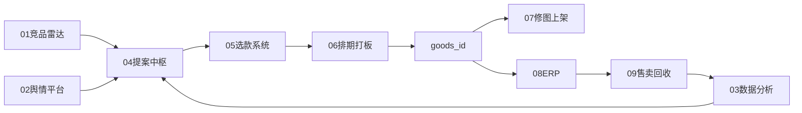

# 00 · 选品平台总规划

## 变更记录

| 版本 | 日期 | 变更内容 | 作者 |
|------|------|----------|------|
| v0.1 | 2026-07-14 | 初稿：双人分环节详案总规划 | B+T |
| v0.2 | 2026-07-15 | 升级三人协作；协作细则见 00B；纳入 T《AI选品调研》 | B+T+C |

## 1. 愿景与一句话

**愿景**：把「看见市场 → 写提案 → 审核立项 → 打板上架 → 售卖回收」打成可追溯闭环，用更少试错成本选对款。

**一句话**：上游信号可合成提案，中游流程可线上审核，下游 goods_id 可回挂售卖效果并校准下一轮选品。

## 2. 问题定义

网站增长核心是选对品。当前断点：

1. **上游原料分散**：竞品、舆情、内部销量各自为政，运营手写 PPT 拼佐证。
2. **中游流程在建**：选款 MVP 可留档，1.0 补审核流，但提案仍人工生产。
3. **下游归因断裂**：打板后才有 goods_id，与修图/ERP/售卖回收未产品化打通。

## 3. 分层架构

| 层 | 职责 | 对应环节文档 |
|----|------|--------------|
| 感知层 | 采外部供给与用户反馈 | 01 竞品、02 舆情 |
| 认知层 | 特征共性、预测分、冲突仲裁 | 03 数据分析 |
| 决策层 | 提案生成 → 审核立项 | 04 提案中枢、05 选款 |
| 执行层 | 排期打板、修图上架、ERP | 06、07、08 |
| 学习层 | 售卖回收、权重迭代 | 09 效果回收 |

## 4. 现有资产与缺口

| 系统 | 状态 | 链路位置 | 本期策略 |
|------|------|----------|----------|
| 竞品分析 / Competitor Radar | 脚本可用，产品化中 | 感知 | 对接增强，不重写爬虫（见 01） |
| 舆情监控平台 | MVP PRD | 感知 | 抽取选品用商品归因供给（见 02） |
| 选款系统 MVP | 已实现 CRUD | 决策 | 复用表单字段 |
| 选款系统 1.0 | 审核流在建 | 决策 | 补草稿灌入与 goods_id 约束（见 05） |
| 数据分析 | **缺位** | 认知 | 新建（见 03） |
| 提案中枢 | **缺位** | 决策 | **P0 新建**（见 04） |
| 版房 Quota | 线下 / 二期草稿 | 执行 | 骨架→P2（见 06） |
| 修图 / 上架 / ERP | 存量系统，弱对接 | 执行 | 事件对接（见 07、08） |
| 效果看板 | 未建（字段已预留） | 学习 | P3（见 09） |

## 5. 分期路线 P0–P3

| 阶段 | 目标 | 文档重点 | 验收 |
|------|------|----------|------|
| **P0** | 提案草案可生成并写入选款草稿提交 | 03 口径初版、04、05、主数据附件 | 试点业务线运营可用；审核人可审 |
| **P1** | 内部销量特征 + 预测分进提案；舆情避雷入 Risk | 03 详化、02 供给 | 提案含三角校验说明 |
| **P2** | Quota 排期线上化；goods_id 正式回写；修图/上架事件 | 06、07 | completed 提案 100% 有 goods_id |
| **P3** | ERP 售卖回收；系统款 vs 人工款对比；规则/模型迭代 | 08、09 | 可出命中率与绩效 |

### P0 非目标（写死）

- 全自动打样下单
- 全自动 AI 素材与全自动上架
- 复杂 Multi-Agent 全自动编排（一期用规则合成 + LLM 写佐证）
- 全业务线同时铺开（试点默认 **BD**，与竞品能力对齐）

## 6. 协作 RACI（三人）

> **完整操作手册、每人每日任务与 Cursor 用法**：见 [00B-三人协作详案规划与执行指引.md](./00B-三人协作详案规划与执行指引.md)。  
> **T 调研吸收**：见 [附件-调研吸收清单.md](./附件-调研吸收清单.md)（源：`AI选品调研.md`）。

| 代号 | 角色 |
|------|------|
| **B** | 业务 Owner：提案 SOP、04/05/06/09、验收 KPI |
| **T** | 技术 Owner：03、主数据/对接、调研吸收、07/08 |
| **C** | 竞品分析平台产品经理：01、竞品+社媒调研纪要、佐证规范 |

| 工作项 | B | T | C |
|--------|---|---|---|
| SOP / 提案页 / 验收 KPI | **A/R** | C | C |
| 竞品/社媒供给与访谈 | C | C | **A/R** |
| 主数据 / 字段流转 | C | **A/R** | R（竞品字段） |
| API / 事件 | C | **A/R** | C |
| 01 竞品对接 PRD | C | R | **A/R** |
| 03 数据分析 PRD | C | **A/R** | C |
| 04 提案中枢 PRD | **A/R** | R | R（佐证块） |
| 05 选款对接 PRD | **A/R** | R | I |
| goods_id / 品类 / 特征权威源 | C | **R** | C |

> A=拍板，R=主笔，C=咨询，I=知会。联接点（字典、signal_refs、goods_id）三人同审。

## 7. 统一主键约定

| 主键 | 层 | 说明 |
|------|----|------|
| `category_line` + `category_code` | 主数据 | 业务线沿用选款枚举 JP/BD/AT/WD/PROM；品类编码统一映射 |
| `feature_set` | 认知/决策 | 归一化特征包（色/面料/领型等） |
| `signal_refs` | 决策 | 溯源：竞品周次、舆情切片、销量切片 |
| `proposal_id` | 中游流程 | PROP-YYYYMMDD-XXXX |
| `goods_id` | 下游商品 | 打板完成写入；修图/上架/ERP/回收共用 |

## 8. 业务线说明（暂不改枚举）

选款系统写死业务线：**JP / BD / AT / WD / PROM**。  
本期**不发明新枚举**。全称由业务 Owner 访谈补全（见附件-开放问题）。试点默认 **BD（伴娘服）**。

## 9. 成功指标（平台级）

| 指标 | P0 目标 | 说明 |
|------|---------|------|
| 提案准备时效 | 相对现状缩短 ≥50%（访谈标定基线） | 从找数到可提交 |
| 系统草案采纳率 | ≥60% 字段被直接采用或轻微修改 | 按字段留痕统计 |
| 审核一次通过率 | 相对基线不下降 | 避免「快但更差」 |
| 溯源完整率 | 100% 系统提案含 signal_refs | 硬门槛 |
| goods_id 回写率 | P2 起 completed=100% | P0 只约束字段与流程 |

## 10. 文档地图

| 文件 | 深度 | 主笔 |
|------|------|------|
| `_PRD统一模板.md` | 模板 | — |
| `00-选品平台总规划.md` | 本文件 | B+T |
| `01-竞品雷达增强对接.md` | 骨架/对接契约 | T |
| `02-舆情选品供给.md` | 骨架 | T |
| `03-销量与特征分析.md` | **P0 详案** | T |
| `04-选品提案中枢.md` | **P0 详案** | B |
| `05-选款系统对接与流程增强.md` | **P0 详案** | B |
| `06-版房排期与打板.md` | 骨架 | B |
| `07-修图上架对接.md` | 骨架 | T |
| `08-ERP与goods_id.md` | 骨架 | T |
| `09-效果回收与迭代.md` | 骨架 | B |
| `附件-字段流转与主数据.md` | **详** | T |
| `附件-系统对接清单.md` | **详** | T |
| `附件-开放问题与拍板表.md` | **详** | B+T |

## 11. 一周执行节奏（回顾）

| 日 | 动作 |
|----|------|
| D1 | 模板对齐；开放问题表挂出三道必拍板题 |
| D2 | 总规划定稿（v0.1） |
| D3–D4 | P0：04、05、03 + 字段附件 |
| D5 | 01/02/06–09 骨架 |
| D6 | 对接清单收敛 |
| D7 | 交叉评审修订 |

## 12. 风险与纪律

1. 禁止两人各建一套 taxonomy；主数据映射共有。  
2. 业务线枚举不擅自扩展。  
3. 每个接口必须写：来源、频率、失败降级、责任人。  
4. AI 结论必须可追溯到结构化数据，禁止无来源编造。
