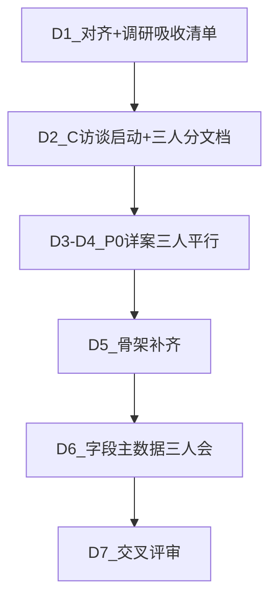

# 00B · 三人协作详案规划与执行指引

## 变更记录

| 版本 | 日期 | 变更内容 | 作者 |
|------|------|----------|------|
| v0.1 | 2026-07-15 | 在双人规划上升级为三人；纳入竞品 PM；接入 T《AI选品调研》 | 项目 Owner |

> 本文件是协作「操作手册」，不替代各环节 PRD。原双人 RACI 见 [00-选品平台总规划.md](./00-选品平台总规划.md)。  
> **勿改** `.cursor/plans` 下计划文件；分工变更以本文为准。

---

## 1. 三人角色定义

| 代号 | 角色 | 核心优势 | 对本项目的定位 |
|------|------|----------|----------------|
| **C** | 竞品分析平台产品经理 | 懂竞品 Radar 能力边界、数据口径、运营怎么用竞品 | 上游感知主笔 + 竞品/社媒供给契约 + 相关访谈 |
| **B** | 业务 Owner（选品运营侧） | 懂提案 SOP、审核标准、选款流程 | 决策层主笔（04/05/06/09）+ 验收与 KPI |
| **T** | 技术 Owner | 懂架构/主数据/接口；已完成对外竞品与 AI 赋能调研 | 认知层与对接主笔（03/附件）+ 技术方案吸收调研 |

### 协作原则

1. **一个人主笔一个文档**，另外两人只做指定章节辅笔或评审，避免三套 taxonomy。  
2. **联接点必须三人同审**：`md_attribute_dict`、中枢字段映射、`signal_refs`、`goods_id`。  
3. **C 不重写选款状态机**；**B 不重写爬虫**；**T 不定审核业务规矩**。  
4. T 的 [AI选品调研.md](file:///C:/Users/AZAZIE/Downloads/AI选品调研.md) 是**公共输入**，由 T 提炼「可落地清单」后三人共用。

---

## 2. 《AI选品调研》如何用进文档（T 先做提炼）

调研已覆盖 Prévoir、知衣 + 自家 AI 赋能七步。落到我们文档的映射：

| 调研结论 | 写入哪份 PRD | 落地级别 |
|----------|--------------|----------|
| Prévoir 六信号打分 + 权重公开可调 | 03（打分维度）、04（机会池解释） | P0 简化权重；P1 可调 UI |
| Hero/Core/Fill + 预算平衡 | 04（方案分层）；00（非目标：P0 不做整盘买货） | P1+ |
| 知衣：电商/社媒/以图搜款 | 01（竞品供给）、C 调研纪要（社媒后台） | 社媒接入 P0 高优（调研写明） |
| 知小衣对话式选品 | 04 远期；00 非目标 P0 不做全对话 Agent | P2 |
| CV 打标签 ~20 属性 | 03/附件主数据；与竞品同字典 | P1 高优 |
| 维度排行榜 → 组合兼容性筛选 | 04 机会合成；03 组合分 | P0 规则版；P1 频率系数 |
| 证据链模板 | 04 source_evidence / signal_refs | **P0** |
| 人工 override 留痕 | 04/05 edit-log | **P0** |

**T 交付物（D1 必交）**：`规划/附件-调研吸收清单.md`  
格式：调研要点 → 我们做/不做 → 对应文档章节 → 优先级。

---

## 3. 文档所有权（三人版）

| 文档 | 主笔 | 辅笔 | 说明 |
|------|------|------|------|
| `00` 总规划 | B+T+C 共更一节「三人RACI」 | — | 用本文覆盖协作；总规划补链到本文即可 |
| `01` 竞品雷达增强对接 | **C** | T | C 写供给契约与场景；T 写 API/表结构 |
| `02` 舆情选品供给 | T | B | 不变；C 评审是否与社媒后台重叠 |
| `03` 销量与特征分析 | **T** | B、C | T 主模型与打分；C 对齐竞品特征字典 |
| `04` 选品提案中枢 | **B** | T、C | B 提案页/验收；T 流水线；C 竞品证据怎么写才「像运营」 |
| `05` 选款对接 | **B** | T | 不变 |
| `06` 排期打板 | **B** | T | 不变 |
| `07` 修图上架 | T | B | 不变 |
| `08` ERP/goods_id | T | B | 不变 |
| `09` 效果回收 | **B** | T、C | C 补「竞品跟款事后对照」指标建议 |
| 附件-字段与主数据 | **T** | C、B | C 主审竞品字段映射 |
| 附件-对接清单 | **T** | C | C 补竞品/社媒后台对接行 |
| 附件-开放问题 | 三人共维 | — | 各写自己 Owner 行的决议 |
| **新增** `附件-调研吸收清单.md` | **T** | C 确认竞品相关 | 见 §2 |
| **新增** `附件-C-竞品与社媒调研纪要.md` | **C** | B | 见 §5 |

---

## 4. 一周节奏（三人）

| 日 | C | B | T |
|----|---|---|---|
| **D1** | 读 00/01/附件字段；列出对竞品平台的问题单 | 读 04/05；准备运营访谈提纲 | 写《调研吸收清单》；同步 Prévoir/知衣 → 我们 P0 边界 |
| **D2** | 约竞品使用方 + 社媒选品后台负责人各 1 场 | 约品类运营/审核人 | 主数据草案；确认订单/PIM 权限路径 |
| **D3** | 写 01 详化（在骨架上加深供给契约） | 精修 04 | 精修 03 + 吸收清单定稿 |
| **D4** | 写《C 调研纪要》；给 04 补「竞品佐证页规范」 | 精修 05 | 联调契约：trends API + create-from-hub |
| **D5** | 评审 02 是否重复；协助 09 竞品对照指标 | 06/09 骨架加深 | 07/08 骨架加深 |
| **D6** | 三人会：特征字典谁说了算、竞品→提案字段 | 同左 | 同左；更新附件-字段 |
| **D7** | 交叉审 01/04 竞品章节 | 交叉审 04/05 业务验收 | 交叉审 03/接口；更新开放问题 |

---

## 5. C（竞品 PM）具体任务包

### 5.1 要写/加深的文档

1. **`01-竞品雷达增强对接.md`**：从骨架升到「可开发」——运营真实怎么用周报/列表；中枢要哪些字段；失败时运营兜底。  
2. **`附件-C-竞品与社媒调研纪要.md`**（新建）必须含：  
   - 竞品平台：现网能力、BD/AT 覆盖、更新频率、盲区  
   - 运营选品后台（社媒）：抓什么、字段、导出/API 可能性、谁维护  
   - 与舆情平台边界（避免跟 02 抢活）  
   - 建议：社媒进中枢的 P0 最小字段集  

### 5.2 要做的调研（人）

| 访谈对象 | 目标 | 产出 |
|----------|------|------|
| 常看竞品周报/列表的运营 | 哪些数会写进 PPT | 「佐证常用字段 Top10」 |
| 竞品平台研发/数据 | API/表、延迟、质量 | 对接一行进「对接清单」 |
| 社媒选品后台负责人 | 接入方式 | 接入评估（可接/可导出/仅截图） |

### 5.3 怎么用 Cursor / AI（推荐流程）

1. **开工作区**：`自动化选品` 文件夹 + 附上 `自动化竞品分析模块PRD.md`、本目录 `01`、T 调研 md。  
2. **提示词模板（调研纪要）**：  
   > 你是竞品分析产品经理。根据 @自动化竞品分析模块PRD.md 与 @AI选品调研.md，列出「选品提案中枢」需要的竞品供给字段清单，区分已有/缺口，不要编造未文档化的 API。  
3. **提示词模板（改 01）**：  
   > 在 @01-竞品雷达增强对接.md 上按 PRD 模板补齐第 7–9 章，聚焦供给契约；禁止重写爬虫方案。  
4. **提示词模板（对照知衣）**：  
   > 对比知衣「社媒选款/竞店监控」与我们竞品+社媒后台，给出我们 P0 只做差集的三条建议。  
5. **纪律**：AI 生成后必须用真实访谈或现网截图校验；数字与接口以研发确认为准。

### 5.4 C 的验收口

- 《C 调研纪要》≥1 次有效访谈纪要（可脱敏）  
- `01` 含完整接口表：来源/频率/降级/责任人  
- 向 B 交付「提案佐证页应出现的竞品证据块」一页规范  

---

## 6. B（业务 Owner）具体任务包

### 6.1 主笔文档

精修 **04、05**；骨架加深 **06、09**；拍板表 **B 区**。

### 6.2 调研（人）

| 对象 | 目标 |
|------|------|
| 写 PPT 的品类运营 | As-Is SOP、耗时、模板页 |
| 审核人 | 通过/打回标准 |
| C 交付的佐证规范 | 合并进 04 页面结构 |

### 6.3 怎么用 Cursor / AI

1. 丢入：选款 1.0、04/05、运营脱敏 PPT。  
2. 提示词：  
   > 把这份 PPT 拆成选款 proposal 字段映射表，标出可自动/必须人工。  
3. 提示词：  
   > 根据 @04 与 Prévoir「证据链+override」思路，补验收标准，保持 P0 不做整盘 Buy Plan。  
4. **不要**让 AI 改状态机语义与 1.0 冲突；变更走开放问题表。

### 6.4 B 验收口

- 4 份可提交原型路径说清（含系统草案）  
- 审核人确认字段集  
- B1 试点锁定；B5 样例到位  

---

## 7. T（技术 Owner）具体任务包

### 7.1 主笔文档

精修 **03**；维护 **附件-字段/对接/调研吸收清单**；骨架 **02/07/08**；开放问题 **D1–D3、T 区**。

### 7.2 调研 / 输入

- 已有：`AI选品调研.md` → 吸收清单  
- 待办：订单/PIM 权限、ERP 销售主题是否存在、与 C 对齐竞品同步表  

### 7.3 怎么用 Cursor / AI

1. **吸收调研**：  
   > 阅读 @AI选品调研.md，输出「我们系统七步」与文档 03/04 的映射表，标 P0/P1/不做，禁止扩大 P0 范围。  
2. **主数据**：  
   > 根据 @附件-字段流转与主数据.md 与竞品 PRD 字段，起草 md_attribute_dict 初始 key 列表。  
3. **接口**：  
   > 根据 @05 与 @01 生成 OpenAPI 草案（仅 draft），标注失败降级。  
4. **参考 Prévoir 权重**：  
   > 设计 P0 四维打分（趋势/内部适配/gap/风险）默认权重，需可解释，输出进 03。  
5. 用 Cursor 改文档时**指定文件**，避免 AI 在 00–09 间大面积改串。

### 7.4 T 验收口

- 《调研吸收清单》评审通过  
- 03 四维打分口径与 04 三角规则不打架  
- create-from-hub / trends 契约可联调  

---

## 8. 每日站会（15 分钟）

固定三个问题：

1. 昨天闭环了哪一节文档/访谈？  
2. 是否出现新的双源口径冲突？（记下开放问题）  
3. 是否挡住别人？（例如 C 未出佐证规范则 B 难写 04 证据块）

---

## 9. 冲突升级路径

| 冲突类型 | 仲裁 |
|----------|------|
| 竞品字段 vs 选款字段 | T 出映射草案 → B 定业务含义 → C 确认竞品侧可出 |
| 社媒后台 vs 舆情平台 | C+T 划界：社媒热度归感知增强；售后差评归 02 |
| P0 是否上 CV 打标 / Buy Plan 分层 | 默认 **P1**；B 若要坚持进 P0，必须砍别的范围 |

---

## 10. 交付清单（三人版增量）

在原交付物基础上增加：

1. `规划/00B-三人协作详案规划与执行指引.md`（本文件）  
2. `规划/附件-调研吸收清单.md`（T）  
3. `规划/附件-C-竞品与社媒调研纪要.md`（C）  
4. `01` 由骨架升为可开发版（C+T）  
5. `04` 增加「竞品佐证块规范」（B 合入 C 输入）  

---

## 11. 给每个人的「开工第一天」检查表

### C 第一天

- [ ] 克隆/打开 `自动化选品` 工作区  
- [ ] 读：竞品 PRD、00、01、00B、AI选品调研（知衣/社媒段）  
- [ ] 用 Cursor 生成「访谈提纲 v0」并人工删虚问  
- [ ] 预约 2 场访谈  

### B 第一天

- [ ] 读：00、04、05、00B、选款 1.0  
- [ ] 用 Cursor 从脱敏 PPT 生成字段映射草案  
- [ ] 预约运营 + 审核人  

### T 第一天

- [ ] 把 `AI选品调研.md` 拷入 `规划/输入/`（或保持 Downloads 路径并在文档中引用）  
- [ ] 用 Cursor 写《调研吸收清单》初稿  
- [ ] 列出 D1–D3 决议所需对接人并约会议  

---

## 12. 成功标准（本轮协作）

1. 三人各自主笔文档无大面积「空章节」。  
2. 主数据只有一份附件，竞品/选款/分析都引用它。  
3. 调研里的「炫技能力」没有未经评审直接膨胀进 P0。  
4. C 的社媒/竞品调研能回答：中枢第一期到底接哪张表/哪个导出。
