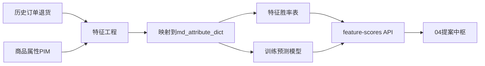

# 03 · 销量与特征分析 PRD（P0 详案）

## 变更记录

| 版本 | 日期 | 变更内容 | 作者 |
|------|------|----------|------|
| v0.1 | 2026-07-14 | 初稿：内部特征共性 + 新品预测分口径 | T 主笔 / B 验收与三角规则 |

> 本模块当前**缺位**。目标是为提案中枢提供「内部是否证明好卖 / 新品冷启动风险」量化输入，并与竞品热度、舆情风险构成三角校验。

---

## 2. 背景与现状 As-Is

- 内部有订单、商品属性、退货等数据，但未产品化为选品特征分。  
- 运营凭经验看销售报表，难以与竞品趋势自动对齐。  
- 新品无销量历史，备货易拍脑袋；业界常见做法是用商品信息特征做监督学习（如 LightGBM）预测销量区间。

### 痛点

| 痛点 | 描述 |
|------|------|
| 内部验证缺失 | 外部热不一定内部能卖 |
| 冷启动难 | 新品无法直接用历史销量 |
| 口径不齐 | 商品属性与竞品特征字典未映射 |

### 干系人

商品/数据分析、品类运营、提案中枢、供应链（备货参考）。

---

## 3. 目标与非目标

### 3.1 目标

1. **路径 A**：历史好卖/滞销款的特征共性 → `success_score` / 特征胜率表。  
2. **路径 B**：基于商品特征的新品销量预测 → `pred_sales`（区间）+ `slow_risk`。  
3. 输出稳定 API/表供 04 提案中枢消费。  
4. 与竞品、舆情信号的**三角规则**可落文案到提案风险区。

### 3.2 非目标

- P0 不追求极致预测精度上线自动备货  
- 不替代财务正式预测  
- 不做全链路 Multi-Agent 自动决策  
- 不直接改 ERP 下单量

---

## 4. 用户与场景

| 角色 | 场景 |
|------|------|
| 品类运营 | 看某颜色×领型是否在我司 BD 历史验证过 |
| 提案中枢 | 生成草案时拉取 success_score / pred_sales |
| 商品负责人 | 审提案时看「预测慢销风险」标签 |
| 数据同学 | 迭代特征与坏 case |

---

## 5. 范围与优先级

| 优先级 | 需求点 |
|--------|--------|
| P0 | 特征字典对齐（引用 md_attribute_dict） |
| P0 | 历史特征胜率 / success_score（按业务线×品类×特征） |
| P0 | 供给 API：`GET /feature-scores` |
| P1 | LightGBM（或同等）新品销量预测与回测面板 |
| P1 | 退货率约束进 risk_flags |
| P2 | 自动回流 09 效果数据重训 |

---

## 6. 业务流程 To-Be



### 6.1 三角校验规则（业务验收口径）

| 竞品热度 | 内部 success | 舆情风险 | 提案建议动作 |
|----------|--------------|----------|--------------|
| 高 | 高 | 低 | 跟进扩品 |
| 高 | 低/无 | 低 | 小测，控量 |
| 高 | 任意 | 高 | 回避或必须写改版点 |
| 低 | 高 | 低 | 长青保留，不强跟外部 |
| 低 | 低 | 任意 | 回避 |

P0：规则可先在中枢硬编码；分数由本模块提供。

---

## 7. 功能需求列表

| ID | 需求 | 验收要点 | 主笔 |
|----|------|----------|------|
| A-01 | 特征映射作业 | 抽检 50 SKU，映射覆盖率可度量 | T |
| A-02 | 胜率表 | 按业务线+品类输出 Top 正/负特征 | T |
| A-03 | success_score | 0–100，可解释（贡献特征列表） | T |
| A-04 | API | 中枢可按 feature_set 查询得分 | T |
| A-05 | 预测模型 P1 | 回测报告：RMSE/分档命中；慢销召回 | T |
| A-06 | 三角文案 | 中枢风险区能展示规则命中原因 | B |

---

## 8. 数据口径与字段

### 8.1 输入

| 来源 | 内容 | 口径注意 |
|------|------|----------|
| 订单 | 销量件数、GMV、下单时间、站点 | 统一时区；是否含取消单需拍板 |
| 商品 | 颜色、面料、领型、廓形、价格带、品类 | 映射到归一值 |
| 退货 | 退货率、退货原因（能连商品归因更好） | 与舆情 L1 可对齐则加分 |
| 曝光可选 | 列表 CTR（有则用） | P1 |

### 8.2 「好卖」临时定义（P0，可配置）

在指定窗口（建议滚动 90/180 天）内，同品类同价格带中：

- 销量件数进入 Top N% **或**  
- 毛利贡献 Top N%（若毛利可得）  

且退货率不超过品类阈值。具体 N% 与阈值 **B 与业务拍板**（见开放问题）。

### 8.3 输出

| 字段 | 类型 | 说明 |
|------|------|------|
| category_line / category_code | string | 主数据 |
| feature_set | json | 归一特征 |
| success_score | number | 0–100 |
| feature_lift | json | 各特征相对基线的提升 |
| pred_sales | object | `{low, mid, high, unit: month}` P1 |
| slow_risk | enum | low/mid/high |
| risk_flags | string[] | 如 `high_return_material` |
| model_version / as_of | string | 可追溯 |
| explain | text | 短解释 |

### 8.4 引用主数据

必须使用 `md_attribute_dict`、`md_category`；禁止模型私有同义词表长期游离。

---

## 9. 系统边界与对接

| 上下游 | 接口/事件 | 频率 | 失败降级 | 责任人 |
|--------|-----------|------|----------|--------|
| ← 数仓/订单 | ETL | 日 | 沿用昨日分 | T |
| ← PIM | 属性快照 | 日 | 缺属性则低置信 | T |
| → 04 中枢 | GET /api/analytics/feature-scores | 按需 | 中枢不展示内部验证块 | T |
| ← 09 回收 | 训练样本回写 | 周 | 人工导出 | T |

```http
GET /api/analytics/feature-scores?category_line=BD&features=color:powder_blue,neckline:cowl
```

---

## 10. 非功能

| 项 | 要求 |
|----|------|
| 可解释 | 每个 score 需返回贡献特征 Top3 |
| 版本 | model_version 变更写 changelog |
| 隐私 | 不输出订单级 PII |
| 性能 | 单次查询 P95 < 500ms（预聚合） |

---

## 11. 验收标准与指标

**业务（B）**

1. 三角规则文案出现在试点提案风险说明中。  
2. 运营认可「好卖定义」与直观经验无系统性矛盾（访谈签字）。  

**技术（T）**

1. P0 胜率表覆盖试点品类主特征维度（色/面料/领型/价格带）。  
2. API 契约联调通过。  
3. P1：相对朴素基线（品类均值）预测分档有可报告提升；慢销占比监控可复现参考案例思路（对照而非承诺同一数字）。

---

## 12. 排期依赖与开放问题

| 问题 | Owner | 状态 |
|------|-------|------|
| 好卖 Top N%、窗口天数、退货阈值 | B | 开放 |
| 订单与商品属性权限开通 | T | 开放 |
| 毛利字段是否可得 | T/财务 | 开放 |
| 预测目标：件数还是 GMV | B | 建议件数+价格带 |

**依赖**：附件主数据 v0.1；04 可降级先上。
