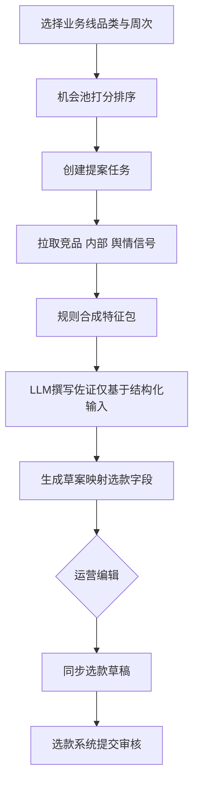

# 04 · 选品提案中枢 PRD（P0 详案）

## 变更记录

| 版本 | 日期 | 变更内容 | 作者 |
|------|------|----------|------|
| v0.1 | 2026-07-14 | 初稿：一期提案生成后台 | B 主笔 / T 接口章 |

> 对齐选款提案表字段，输出**可提交审核的提案草案**（完整方案而非一句建议）。对外话术：帮运营提效；对内目标：字段结构化、可自动化留痕。

---

## 2. 背景与现状 As-Is

### 2.1 现状

1. 品类运营每周调研竞品/社媒/内部数据，制作选品提案 PPT。  
2. 线下或选款系统提交后，品类负责人一审、商品负责人终审。  
3. 竞品周报、舆情、销量数据已有或在建，但**无法自动灌入提案字段**。  
4. 选款 MVP 已支持提案留档；1.0 补状态流转（见 `05`）。

### 2.2 痛点

| 痛点 | 描述 |
|------|------|
| 找数耗时 | 竞品 Excel、周报、社媒后台、内部 BI 来回切换 |
| 佐证难复用 | PPT 截图无法检索、无法按特征聚合 |
| 口径不一 | 同色多名、同领型多写法，审核难横向对比 |
| 无法归因 | 事后不知提案依据来自哪一周竞品/哪段销量 |

### 2.3 干系人

| 角色 | 诉求 |
|------|------|
| 品类运营 | 少拼 PPT，多做判断；草案可改可交 |
| 品类负责人 | 提案结构稳定、证据可点开 |
| 商品负责人 | 价位/差异化/风险一眼可见 |
| 数据/研发 | 字段可机读、可对接选款 API |

---

## 3. 目标与非目标

### 3.1 目标

1. 基于竞品 +（可用范围内）内部信号 + 舆情风险，生成对齐选款字段的**提案草案**。  
2. 运营可编辑后**一键写入选款系统草稿**并进入现有审核流。  
3. 100% 系统生成提案携带 `signal_refs` 溯源。  
4. 留痕：系统填 vs 人工改，服务后续学习。

### 3.2 非目标（P0 不做）

- 替代审核人决策 / 自动终审通过  
- 全自动打板、修图、上架  
- 完美销量预测（03 仅提供可用则注入的分数）  
- 全业务线铺开（试点 **BD**）

---

## 4. 用户与场景

| 角色 | 场景 | 路径 |
|------|------|------|
| 品类运营 | 周选会前准备伴娘服新色提案 | 选业务线/品类 → 浏览机会池 → 生成草案 → 改图与佐证 → 同步至选款草稿 → 提交一审 |
| 品类运营 | 从竞品某 SKC 发起跟款 | 竞品详情「生成提案」→ 预填设计点与参考图 → 编辑 → 同步 |
| 品类负责人 | 预审系统草案质量 | 选款详情看溯源区，决定通过/驳回 |

---

## 5. 范围与优先级

| 优先级 | 需求点 | 说明 |
|--------|--------|------|
| P0 | 机会池 | 按业务线/周次展示候选特征组合与证据摘要 |
| P0 | 一键生成草案 | 映射选款必填字段，缺省可标「待补」 |
| P0 | 人工编辑 | 全字段可改；改动留痕 |
| P0 | 同步选款草稿 | 调用选款创建/更新草稿 API |
| P0 | 溯源面板 | signal_refs 可点击回竞品周报/切片 |
| P1 | 舆情避雷注入 | Risk 段自动带差评 L1 Top |
| P1 | 销量预测分展示 | 商业测算区 |
| P2 | 导出 PPT/PDF | 对齐历史审核习惯作过渡 |

---

## 6. 业务流程 To-Be



### 6.1 机会评分规则（P0 简化）

| 场景 | 竞品信号 | 内部信号（适配度+象限） | 舆情/退货 risk | 建议动作 |
|------|----------|------------------------|----------------|----------|
| 双高 | 热（上新/排名升/Top 色） | ≥70 或 **重点机会/成熟优势** | 低 | 跟进 / 主力候选 |
| 外热内弱 | 热 | <70 / **持续观察** / 缺失 | 中低 | 小测 |
| 外热内冗余 | 热 | **风险冗余** 或 高退货 | 任意 | 回避或改版 |
| 外热+差评高 | 热 | 任意 | 高（尺码/面料/图货） | 回避或改版说明 |
| 内好外冷 | 冷 | **重点机会** | 低 | 内部扩产；`source_type=Internal Data` |
| 内好外冷 | 冷 | 成熟优势 | 低 | 长青保留，不强扩 |

分数明细写入草案「风险说明」，不得静默抹平冲突。

---

## 7. 功能需求列表

| ID | 需求 | 验收要点 | 主笔 |
|----|------|----------|------|
| H-01 | 机会池列表 | 可按业务线、周次、来源类型筛选；展示分数与一句话理由 | B |
| H-02 | 生成草案 | 30 秒级出可编辑表单；必填项有值或明确「待补」标记 | T |
| H-03 | 字段映射 | 覆盖选款 P0 必填字段（见第 8 节） | B+T |
| H-04 | 溯源 | 每条关键结论至少 1 条 signal_ref | T |
| H-05 | 编辑留痕 | 记录 field_name / before / after / editor / time | T |
| H-06 | 同步草稿 | 成功返回 proposal_id；失败可重试且不重复建单（幂等键） | T |
| H-07 | 权限 | 仅本业务线运营可生成/同步；负责人只读机会池可选 | T |
| H-08 | 降级 | 竞品接口失败时允许「纯手工+部分信号」模式并标黄 | T |

---

## 8. 数据口径与字段

### 8.1 输入

| 来源 | 字段/包 | 说明 |
|------|---------|------|
| 竞品 | data_week, top_colors, top_attrs, new/delisted, sample SKCs | 01 供给契约 |
| 舆情 | pdl1/pdl2 Top、避雷标签 | 02；P0 可手工粘贴，P1 自动 |
| **内部建议引擎** | `internal_fit_score`, `quadrant`, `suggestion_id`, `attr_dimension/value`, `skc_refs[]`, `period` | 《内部数据选品建议引擎 PRD》；P0 人工上传报表，P1 拉取，P2 `GET /internal/suggestion-pack` |
| 用户 | category_line, category, 手工约束（价位带、码型偏好）, `internal_period` | 创建向导 |

### 8.2 输出（对齐选款 proposal）

| 选款字段 | 自动填充策略 | 人工必审 |
|----------|--------------|----------|
| category_line / category | 向导选定 | 是 |
| source_type | 主证据：Competitor / Internal Data / Trend | 是 |
| source_evidence | 结构化摘要 + LLM 成文；含冲突说明 | 是 |
| front_image 等 | 竞品参考图 URL | 是（定稿常替换） |
| size_type | 默认基础码或历史同款 | 是 |
| reusable_pattern / has_fabric / fabric_name | 面料库匹配 + 趋势关键词 | 是 |
| target_price | 竞品带 ∩ 内部成功带 | 是 |
| wearing_scene | 场景标签 | 否 |
| key_design_points | feature_set Top 3–5 | 是 |
| special_process | 工艺关键词 + 舆情工艺风险 | 是 |
| generation_source | `system_hub`（选款侧扩展，见 05） | 系统 |
| signal_refs | JSON 数组 | 系统只读展示 |

### 8.3 引用主数据

- `md_category`、`md_attribute_dict`（见附件-字段流转与主数据）  
- 禁止中枢私建第二套颜色/面料字典。

---

## 9. 系统边界与对接

| 上下游 | 接口/事件 | 频率 | 失败降级 | 责任人 |
|--------|-----------|------|----------|--------|
| ← 竞品 | `GET /trends` `GET /changes` 或同步表 | 周 / 按需 | 标黄，手工佐证 | T |
| ← 舆情 | `GET /selection/risk-pack` | 日 / 按需 | 跳过 Risk 段 | T |
| ← **内部建议引擎** | P0：`POST /internal/report-upload`（XLSX ②④⑤）；P1：`GET /internal/suggestion-pack?line&category&period&attrs[]` | 周 / 按需 | **internal 维留空**，佐证标黄 | T |
| → 选款 | `POST /api/proposal/create-from-hub` | 同步时 | Toast 失败，保留本地草案 | T |
| → 选款 | 幂等键 `hub_draft_id` | — | 防重复提案 | T |

### 9.1 建议 API（中枢）

```http
POST /api/hub/opportunities/query
POST /api/hub/drafts/generate
PUT  /api/hub/drafts/{id}
POST /api/hub/drafts/{id}/sync-to-selection
GET  /api/hub/drafts/{id}/edit-log
```

---

## 10. 非功能

| 项 | 要求 |
|----|------|
| 性能 | 生成草案 P95 < 30s（不含超大图片转存） |
| 权限 | 业务线隔离；审计日志保留 ≥180 天 |
| 内容安全 | LLM 仅可使用注入的 JSON/表格，系统 prompt 禁止编造数字 |
| 可用性 | 竞品全部失败时仍可纯手工创建草案并同步 |

---

## 11. 验收标准与指标

1. BD 试点：运营用中枢完成 ≥3 份真实可提交提案。  
2. 结构：审核人确认「字段集合 ≈ 现有提案/选款表单」，无需另学 PPT 结构。  
3. 溯源完整率 100%。  
4. 同步成功率 ≥95%（网络类可重试后计）。  
5. 访谈口径：准备时长相对基线下降（基线在访谈中标定）。

---

## 12. 排期依赖与开放问题

| 问题 | Owner | 状态 |
|------|-------|------|
| 选款是否接受 generation_source / signal_refs 扩展字段 | B+T / 选款研发 | 开放 |
| 试点是否锁 BD | B | 建议锁定，待确认 |
| 历史 PPT 模板页级对照（附样例） | B 访谈 | 开放 |
| 竞品 API 还是数仓表优先 | T | 开放 |

**依赖**：01 供给可读；05 草稿 API；附件主数据 v0.1；**内部引擎 P0 报表样例**可与 04 并行；内部 P1 API 不阻塞 P0 人工贴数路径。
