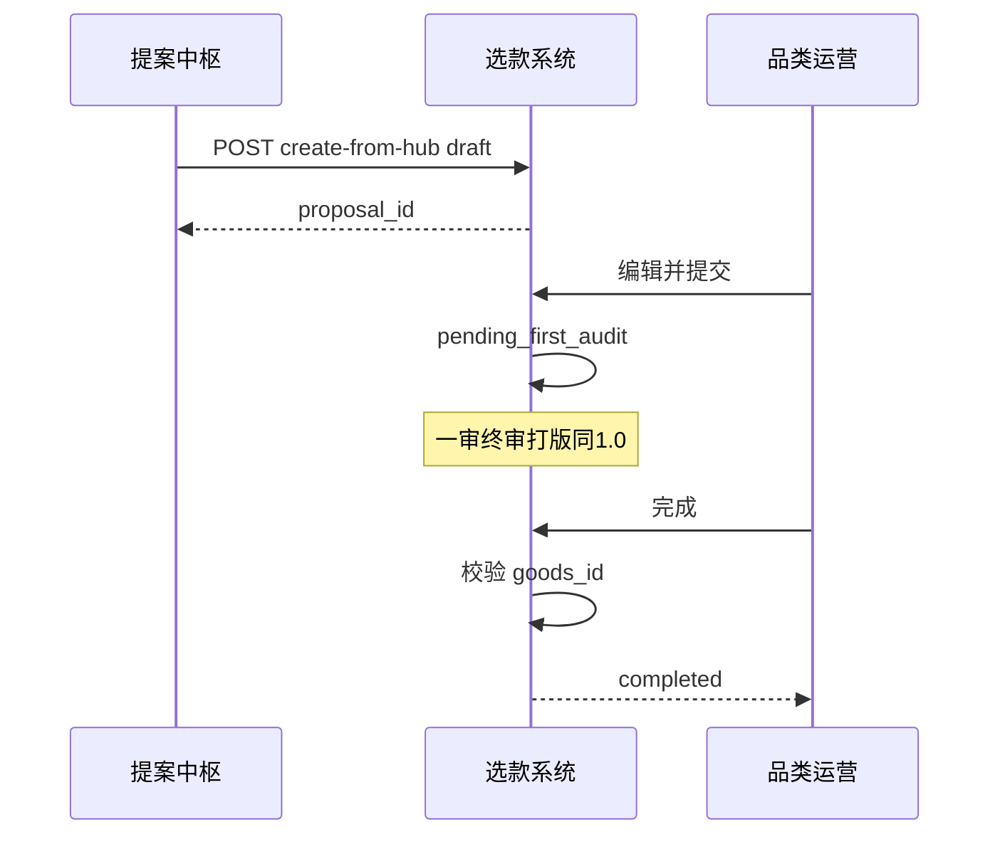

# 05 · 选款系统对接与流程增强 PRD（P0 详案）

## 变更记录

| 版本 | 日期 | 变更内容 | 作者 |
|------|------|----------|------|
| v0.1 | 2026-07-14 | 初稿：上游灌入 + 下游 goods_id 约束，不改终审语义 | B 主笔 / T 接口 |
| v0.2 | 2026-07-17 | 对齐现网「创建提案」页；雷达 Excel 实表列→灌入字段（见主方案 v2.1 §3.5） | T / B |

> 基线文档：[选款系统MVP.md](../选款系统MVP.md)、[选款系统1.0.md](../选款系统1.0.md)。  
> 本文件**不重写完整状态机**，只定义与提案中枢、goods_id、回收相关的增强点。

---

## 2. 背景与现状 As-Is

### 2.1 已有能力

| 版本 | 能力 |
|------|------|
| MVP | 提案 CRUD、角色权限、提案留档 |
| 1.0 | 状态流转：草稿→一审→终审→打版路径→完成/终止；版师导出版单；`goods_id` 字段预留 |

### 2.2 缺口

1. 提案内容仍靠运营从零填写，与竞品/分析无自动衔接。  
2. `goods_id` 无强制回写与索引策略，无法支撑售卖归因。  
3. 无法区分「系统生成提案」与「纯人工提案」。

### 2.3 干系人

品类运营、品类负责人、商品负责人、版师、选款研发、提案中枢研发。

---

## 3. 目标与非目标

### 3.1 目标

1. 提供稳定 API，使提案中枢可创建/更新**草稿**并带入标准字段。  
2. 扩展轻量元数据：`generation_source`、`hub_draft_id`、`signal_refs`（或旁表）。  
3. 明确 `completed` 时 `goods_id` 必填规则（流程约束，对接 06）。  
4. 字段级编辑留痕可查询（中枢或选款二选一落库，推荐中枢写、选款存快照）。

### 3.2 非目标

- 改变一审/终审角色职责与主路径业务含义  
- 本期上线版房 Quota 排期（见 06）  
- 本期上线 ERP 绩效看板（见 09）  
- 替代 OC 审核体系（若未来接入，仅做映射）

---

## 4. 用户与场景

| 角色 | 场景 |
|------|------|
| 品类运营 | 从中枢同步后，在选款列表看到草稿，检查后点提交 |
| 品类负责人 | 一审时查看「系统生成」标签与溯源折叠区 |
| 版师 | 仍仅在 in_progress/completed 导出版单（不变） |
| 品类负责人 | 点完成时若无 goods_id 则阻断并提示 |

---

## 5. 范围与优先级

| 优先级 | 需求点 |
|--------|--------|
| P0 | 中枢灌入草稿 API + 幂等 |
| P0 | generation_source / hub_draft_id |
| P0 | 详情页只读展示 signal_refs（若有） |
| P0 | completed 时 goods_id 必填校验 |
| P1 | 提案列表筛选「系统生成 / 人工」 |
| P1 | goods_id 索引与唯一性校验 |
| P2 | 与修图/ERP 状态只读展示 |

---

## 6. 业务流程 To-Be（相对 1.0 的增量）

主状态机仍以 1.0 为准：

```text
draft → pending_first_audit → pending_final_audit
      → priority_eval / in_ai_preview / in_external_progress
      → in_progress → completed | terminated
```

**增量节点：**

1. **创建**：中枢 `sync` → 选款 `draft`（`generation_source=system_hub`）。  
2. **提交**：运营在选款内提交，进入一审（与手工提案相同）。  
3. **完成**：`complete` 动作增加校验：`goods_id` 非空。  
4. **审计**：提交时把中枢 edit-log 摘要写入 audit 备注或旁表（可选 P0）。



---

## 7. 功能需求列表

| ID | 需求 | 验收要点 | 主笔 |
|----|------|----------|------|
| S-01 | 创建草稿 API | 校验必填子集；返回 proposal_id | T |
| S-02 | 幂等 | 相同 hub_draft_id 重复调用不新建 | T |
| S-03 | 元数据字段 | generation_source、hub_draft_id 可存可查 | T |
| S-04 | 溯源展示 | 详情只读展示 signal_refs JSON/链接列表 | B+T |
| S-05 | 完成校验 | 无 goods_id 无法 completed | B |
| S-06 | 列表标签 | 「系统生成」Pill（P1 可先详情） | B |
| S-07 | 权限 | 中枢服务账号仅能写本业务线草稿 | T |
| S-08 | 驳回重提 | 与 1.0 一致：重回一审；hub_draft_id 保持 | B |

---

## 8. 数据口径与字段

### 8.1 提案表增量字段（建议）

| 字段名 | 类型 | 必填 | 说明 |
|--------|------|------|------|
| generation_source | varchar(20) | ✓ | `manual` / `system_hub`；默认 manual |
| hub_draft_id | varchar(64) | ✗ | 中枢草案 ID；系统生成时必填 |
| signal_refs | json | ✗ | 溯源数组；大文本可旁表 |
| goods_id | varchar(50) | 完成时✓ | 已有预留；completed 强制 |

### 8.2 signal_refs 元素建议结构

```json
{
  "type": "competitor_trend|opinion_risk|sales_score",
  "ref_id": "2026-W23|slice_id|model_run_id",
  "title": "BG Powder Blue 上新 Top",
  "url": "https://..."
}
```

### 8.3 与中枢字段映射

完整业务表见主方案 v2.1 **§3.5**（选款「创建提案」界面）及 [附件-字段流转与主数据.md](./附件-字段流转与主数据.md) 第 5 节。

**现网创建页必填 ← 雷达实表（摘要）**

| 创建提案字段 | 雷达列 / 规则 |
|--------------|----------------|
| category_line | 向导 BD/AT/… |
| category | 「类目」→ 选款品类映射表（待确认） |
| source_type | 默认 `Competitor`（跟款）；社媒热可改 `Trend` |
| submitter_name | 登录用户 |
| front_image | 「主图」 |
| source_evidence | 品牌+链接+主图+周次+排序/涨跌+价格+SKC（Competitor 佐证规范） |
| target_price | 「售价」优先，否则「标价」 |
| fabric_name | 从「商品详情描述」解析；无则待补 |
| size_type / reusable_pattern / has_fabric | 默认基础码 / 0 / 视面料解析 |

雷达列集合以 `azazie_atelier_report_*.xlsx`、`azazie_report_*.xlsx` 的「原始排序/上新/下架」表头为准，不私增列名。

核心：中枢输出必须能填满选款「提交审核」必填项，或明确允许「保存草稿不校验、提交才强校验」（与现网一致）。

### 8.4 引用主数据

业务线枚举不变：JP/BD/AT/WD/PROM。品类下拉仍选款配置；与 `md_category` 映射表维护。

---

## 9. 系统边界与对接

| 上下游 | 接口/事件 | 频率 | 失败降级 | 责任人 |
|--------|-----------|------|----------|--------|
| ← 提案中枢 | `POST /api/proposal/create-from-hub` | 同步时 | 返回 4xx/5xx 错误码 | 选款 T |
| ← 提案中枢 | `PUT /api/proposal/update-from-hub/{id}` | 仅 draft/withdrawn/reject 态 | 非草稿拒绝 | 选款 T |
| → 06 打板 | 完成时写 goods_id | 动作时 | 阻断完成 | B 流程 |
| → 07/08 | 事件 `goods_id.assigned`（P2） | 完成时 | 记日志人工补 | T |
| → 09 | 读 generation_source + goods_id | 报表 | — | T |

### 9.1 create-from-hub 请求体（草案）

```json
{
  "hub_draft_id": "HUB-20260714-0001",
  "generation_source": "system_hub",
  "category_line": "BD",
  "category": "Bridesmaid Dresses",
  "submitter_name": ["张三"],
  "source_type": "Competitor",
  "source_evidence": "<html>...</html>",
  "front_image": "https://...",
  "back_image": "",
  "detail_images": [],
  "size_type": "基础码",
  "reusable_pattern": 0,
  "has_fabric": 1,
  "fabric_name": "Matte Satin",
  "target_price": "$120-150",
  "wearing_scene": "Wedding party",
  "key_design_points": "Cowl neck; Column",
  "special_process": "",
  "signal_refs": []
}
```

---

## 10. 非功能

| 项 | 要求 |
|----|------|
| 兼容 | 不影响手工创建提案的默认路径 |
| 审计 | 中枢写入操作写入 audit_log（action_type=`hub_sync`） |
| 安全 | 服务间鉴权；禁止跨业务线写草稿 |
| 性能 | 创建草稿接口 P95 < 1s |

---

## 11. 验收标准与指标

1. 中枢可成功创建 BD 业务线草稿，字段在详情页可见。  
2. 重复 sync 同一 `hub_draft_id` 不产生第二份提案。  
3. 手工提案 `generation_source=manual` 行为与改前一致。  
4. 无 goods_id 时无法点「完成」（或等价动作）。  
5. 一审/终审状态流转与 1.0 用例回归通过。

---

## 12. 排期依赖与开放问题

| 问题 | Owner | 状态 |
|------|-------|------|
| signal_refs 存主表 JSON 还是旁表 | T | 开放，建议 JSON 先上 |
| goods_id 是否全局唯一、谁发放 | T+商品 | 见开放问题表 |
| 终审驳回后是否允许中枢再次覆盖字段 | B | 建议：仅 draft 类状态允许 update-from-hub |
| OC 映射是否本期 | B | 默认不做 |

**依赖**：选款 1.0 状态机可用；04 中枢同步联调；06 定义完成态操作人。
