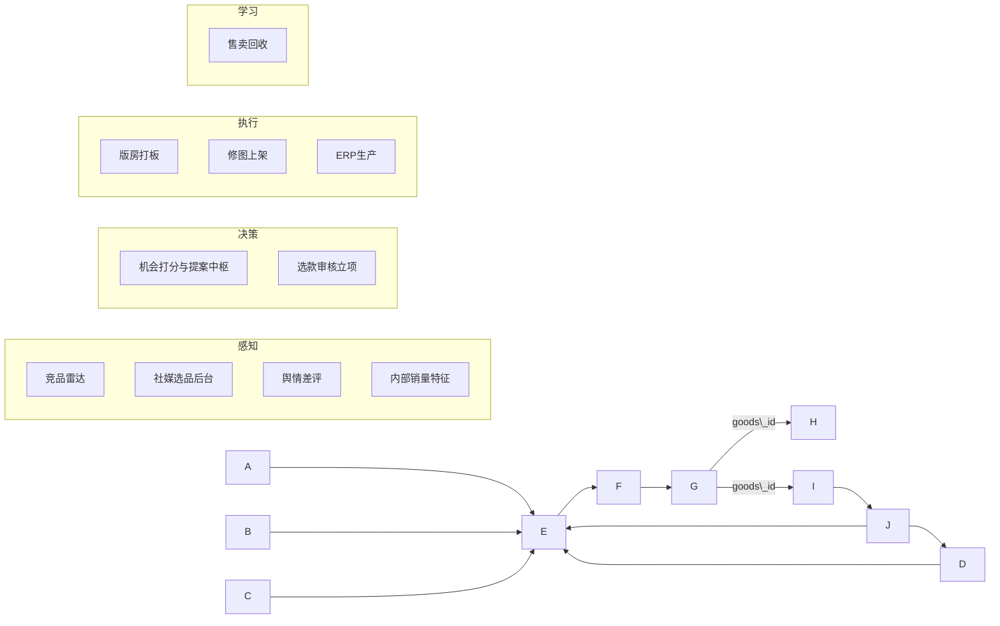

# 选品智能化平台 · 战略规划与一期方案（老板决策简报）

|版本|日期|说明|
|-|-|-|
|v1.0|2026-07-15|合并碎片详案为全局视角；方法论参考 [pm-skills · Product Strategy Canvas](https://github.com/phuryn/pm-skills)|
|→ 完整版|2026-07-15|**请改读完整主文档**（按大纲写满 12 章）：`选品智能化平台-战略规划与一期方案.md` / `.docx`|

> **本文用途**：立项对齐、资源申请、跨团队拍板。读完应能回答：为什么做、做什么、不做什么、谁来做、多久见效、成功长什么样。  
> **完整主成稿**：`规划/选品智能化平台-战略规划与一期方案.md`（Word 同名 `.docx`）。  
> **更细的工程文档**（接口/字段）仍在 `规划/` 子目录。

\---

## 一、一句话与愿景

**一句话**  
把「找趋势 → 写提案 → 审核打板 → 上架售卖 → 用结果校准下一轮」做成可追溯闭环，用更少试错选对款。

**愿景（Strategy Canvas · Vision）**  
让品类运营把时间花在判断上，而不是找数和拼 PPT；让每一次选款都能回溯依据、能评估对错，从而形成公司级选品能力资产，而不是个人经验。

**现在为什么做**

|驱动|说明|
|-|-|
|业务|站点增长核心依赖选品质量；试错贵、周期长|
|能力已备一半|竞品抓取/周报、选款流程系统、舆情平台已有基础|
|行业参照|Prévoir（加权打分+可解释买货方案）、知衣（电商/社媒选款）已证明「结构化信号 → 可执行方案」路径|

\---

## 二、痛点：现在卡在哪

面向老板的「问题陈述」，对应用户工作（JTBD）：**每周要交一份能过审的选品提案，并尽量提高上新后的好卖概率。**

|#|痛点|现状表现|业务代价|
|-|-|-|-|
|1|**信号散**|竞品 Excel/周报、社媒后台、内部销量、差评各看各的|同一机会被重复劳动；口径打架|
|2|**提案慢**|手写 PPT，找数+拼图耗时高|会议堆案、错过趋势窗口|
|3|**难复盘**|PPT 难检索；系统款/人工款分不清|选品绩效说不清；经验不沉淀|
|4|**链断裂**|打板后才有 goods\_id，与修图/ERP/销售弱关联|「选对没有」无法用销售闭环验证|

```text
现状：人肉拼信息 ──► PPT ──► 会审 ──► 线下排期打板 ──► 上架 ──► 销售？说不清
目标：系统出草案 ──► 人审 ──► 线上流程 ──► goods\_id 贯通 ──► 效果回写校准
```

\---

## 三、我们要建成什么（全局一张图）

做**选品决策链条**：



|层|解决什么|我们已有 / 要建|
|-|-|-|
|感知|外面火什么、用户恨什么、我们卖过什么|竞品脚本已有；舆情在建；社媒后台待接入；销量分析待建|
|决策|生成可提交提案 + 线上审核|**一期核心：提案中枢**；选款 1.0 审核流|
|执行|打板→上架→下单|流程部分在线；排期/修图/ERP 对接后续|
|学习|好卖/卖不动回写下一轮|goods\_id 归因看板（后置，但一期先打标）|

\---

## 四、价值主张（对谁、前后对比）

|对象|现在（What before）|以后怎么交付（How）|之后（What after）|
|-|-|-|-|
|品类运营|到处找数拼 PPT|机会池 + 一键草案，对齐选款字段|准备时间砍半级；证据可点开|
|审核人（品类/商品负责人）|看口述和散截图|统一结构 + 冲突/风险写明|审得更快，依据更硬|
|管理层|难量化选品贡献|提案来源打标 → 将来挂 goods\_id 销售|能回答「系统是否帮我们选对了」|
|数据/产品|能力散落多系统|统一主键与特征字典|可复用的选品数据资产|

**相对市面工具的定位**  
我们不是外购「全网选款 SaaS」替代品，而是把 **Azazie 已有竞品/流程/订单** 焊成闭环——数据在内、决策在内、归因在内，这是外购工具难替代的护城河。

\---

## 五、明确不做什么（Trade-offs · 画饼必写）

说「不」才能让老板相信一期可控：

|一期不做|原因|
|-|-|
|全自动打样 / 全自动上架 / 免审通过|风险与品牌失控；归因混乱|
|照搬 Prévoir 整盘 Buy Plan（预算自动铺 Hero/Core/Fill）|我方主路径是「单提案过审」，整盘是二期增强|
|一上来全对话 Agent / 全网以图搜款|炫技、交付重；不解决本周提案效率|
|全业务线同时铺开|先 **BD（伴娘服）** 打通，与现有竞品能力对齐|
|用模型直接决定备货量进 ERP|财务与供应链需单独立项|

\---

## 六、一期（P0）到底交付什么

**一期目标一句话**  
BD 试点上，运营能用系统生成**可提交的选品提案草案**，进现有选款审核流；每份系统提案都有证据溯源，并打上「系统生成」标记，为日后效果回收铺路。

### 6.1 必做能力包

1. **信号汇总（最小可用）**

   * 竞品：周趋势 / 上新下架 / Top 特征 / 样本图链（已有能力产品化对接）
   * 社媒：评估并接入运营已有后台的最小字段（声量/热款）
   * 内部：历史好卖特征分（可先规则，后模型）
   * 风险：差评避雷可先半自动
2. **提案中枢**

   * 机会列表 → 一键生成草案（映射选款表单）→ 人改 → 写入选款草稿
   * 可解释打分（趋势 / 内部适配 / 缺口 / 风险）
   * 证据链：结论必须挂到来源周次/样本
3. **选款对接**

   * 不改审核权威；补系统来源标记与完成态 `goods\_id` 约束

### 6.2 一期成功标准（可验收）

|指标类型|指标|目标（建议，访谈后可调）|
|-|-|-|
|**北极星（North Star）**|系统辅助提案的「上新后有效命中率」相对人工基线|先建立测量；二期追平/超过|
|**本季 OMTM**|单份提案准备时长|相对现状 **≥50% 缩短**（基线访谈标定）|
|采用|系统草案字段被直接采用或轻改比例|≥60%|
|质量底线|审核一次通过率|不低于现状基线|
|合规|系统提案溯源完整率|**100%**|
|闭环预埋|系统生成提案打标率|**100%**|

> 参考业界叙事（作方向，不作承诺）：选款效率、慢销占比改善在对标产品中有数量级案例；我们以\*\*自有基线实验\*\*为准。

### 6.3 解决痛点对照

|痛点|一期如何缓解|
|-|-|
|信号散|一处看机会 + 统一特征口径起步|
|提案慢|草案自动生成，人对齐审核习惯|
|难复盘|来源打标 + 溯源；为 goods\_id 回收留钩子|
|链断裂|一期不修全链，但钉死主键与打标，避免以后重做|

\---

## 七、路线图（全局操作视角）

|阶段|时间感|老板看到的结果|团队在干嘛|
|-|-|-|-|
|**P0 提案提效**|约 1–2 个迭代周期起可见原型|BD 能出可提交草案|中枢+竞品供给+选款灌入|
|**P1 更准**|接在 P0 后|提案带内部验证分与差评风险|销量特征/预测、舆情自动避雷、打分权重可调|
|**P2 跑得顺**|中期|打板排期可视；goods\_id 正式贯通修图/上架|Quota、事件对接|
|**P3 证伪/证明**|持续|系统款 vs 人工款销售对比报表|ERP 取数、规则/模型迭代|

**关键假设（必须为真，否则战略失效）**

1. 运营愿意用「80 分草案」而不是坚持从零写 PPT。
2. 审核人接受统一结构，不要求恢复旧 PPT 版式为唯一载体。
3. 竞品+有限内部数据，足以支撑「不更差」的选款辅助。
4. 订单/商品属性能开权限做特征分析（可晚于中枢上线）。

**低成本验证（建议立项同时做）**

* 用 3 份历史过审提案：人工 vs 系统草案字段覆盖对照。
* 选 1 位运营影子试用一周，量准备时长。

\---

## 八、怎么运转：三人作战与节奏

|角色|谁|负责|
|-|-|-|
|**B 业务**|懂选品运营/审核|提案体验、验收口径、运营访谈|
|**T 技术**|懂架构与数据|打分/主数据/接口；吸收业界调研|
|**C 竞品 PM**|竞品分析平台产品|竞品与社媒供给、运营真实用法、证据规范|

**近两周协作动作（给资源的理由）**

|人|动作|
|-|-|
|C|访竞品/社媒后台 → 确认中枢第一期接哪些表/导出|
|B|访写提案与审核人 → 锁模板与试点 BD|
|T|四维打分口径 + 选款草稿 API 契约；把业界调研收成「做/不做」清单|

日常：短站会对齐「有没有两套口径」；**特征字典只保留一份**。

\---

## 九、需要老板拍的板（决策清单）

|#|决策项|建议|若否|
|-|-|-|-|
|1|是否批准以「提案中枢 P0」为选品智能化一期主线|批准|继续局部工具、难闭环|
|2|试点是否锁定 BD|是|范围失控|
|3|一期是否明确不做全自动上架/整盘 Buy Plan|是|排期与风险飙升|
|4|是否授权打通订单/PIM（可分期）与选款草稿写入|是|内部验证与提效打折|
|5|是否指定 B/T/C 为三人虚拟小组并给访谈窗口|是|文档无法变业务事实|

\---

## 十、投入与回报（画饼但可证伪）

**投入（量级）**  
产品+业务三人兼职推进规划与验收；研发在 P0 以「中枢 + 对接」为主，复用竞品与选款，避免从零造数仓。

**回报叙事**

1. **效率**：提案准备时长下降（本季可证）。
2. **质量过程**：审核依据标准化，减少「拍脑袋跟款」。
3. **资产**：选品知识从 PPT 进系统，可检索、可归因。
4. **期权**：goods\_id 打通后，能量化选品 ROI——这是向经营结果升级的关键期权。

**风险**  
数据口径不统一、运营不adoption、把一期做成大而全 Agent。缓释：trade-off 写死、BD 试点、双轨（系统草案+人工）并存一个迭代。

\---

## 十一、附录：材料地图（不必会上展开）

|老板可读|路径|
|-|-|
|**本文**|`规划/选品平台-老板决策简报.md`|
|三人怎么干活|`规划/00B-三人协作详案规划与执行指引.md`|
|业界调研如何裁进一期|`规划/附件-调研吸收清单.md`（源：Downloads/AI选品调研.md）|
|工程细案（按需）|`规划/00`–`09` 与附件字段/对接|

方法论参考：pm-skills — Product Strategy（愿景/价值/取舍/指标）、Discovery Metrics（North Star / OMTM）、明确假设与小实验。

\---

## 十二、建议会上 5 页讲法

1. 痛点与代价（第二节表）
2. 目标闭环图（第三节）
3. 一期交付与成功标准（第六节）
4. 不做清单 + 路线图（第五、七节）
5. 要老板拍的 5 个板（第九节）

